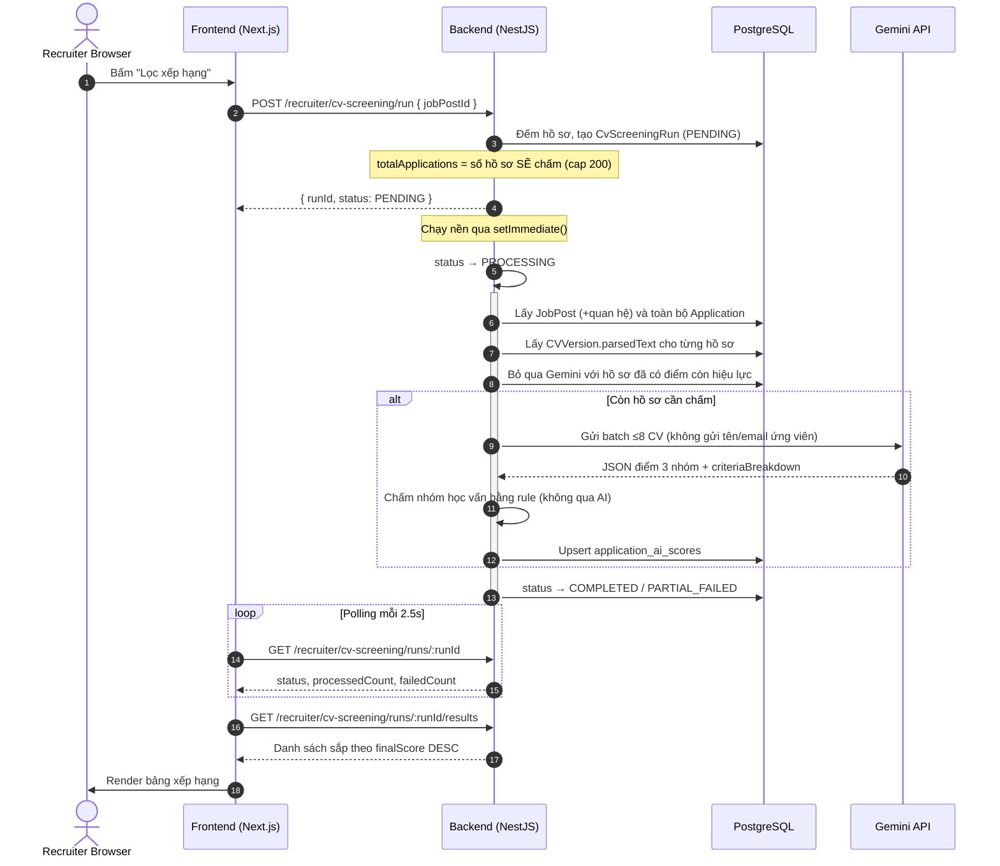
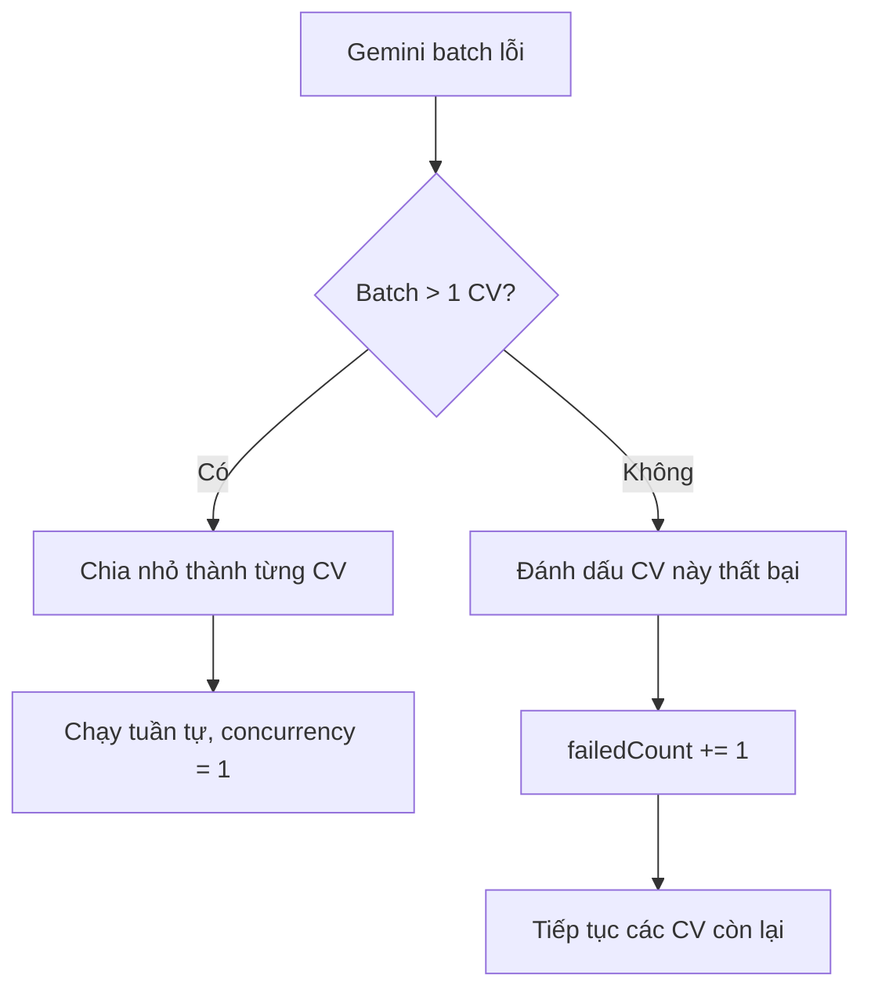

# Luồng kỹ thuật Lọc CV bằng AI (AI CV Screening Flow)

Tài liệu mô tả luồng kỹ thuật của tính năng **Lọc CV bằng AI**, từ giao diện Recruiter (Next.js) → xử lý nghiệp vụ NestJS → chấm điểm bằng Gemini → lưu PostgreSQL → hiển thị kết quả.

> **Phạm vi:** tài liệu này phản ánh code tại thời điểm `scoringVersion = cv-screening-v10-no-retrieval-vi`.
> Khi đổi rubric hoặc công thức điểm, **phải** bump `SCORING_VERSION` trong [cv-screening.service.ts](file:///f:/upnext-backend/src/modules/cv-screening/cv-screening.service.ts) và cập nhật tài liệu này cùng lúc.

---

## 1. Bản đồ file

### 1.1. Backend (`upnext-backend`)

| Chức năng                     | File                                                  |
| :---------------------------- | :---------------------------------------------------- |
| **API Controller**            | `src/modules/cv-screening/cv-screening.controller.ts` |
| **Điều phối Run**             | `src/modules/cv-screening/cv-screening.service.ts`    |
| **Chấm điểm Gemini**          | `src/modules/cv-screening/gemini-scoring.service.ts`  |
| **Rubric 100 điểm**           | `src/modules/cv-screening/scoring-rubric.ts`          |
| **Chấm học vấn (rule-based)** | `src/modules/cv-screening/education-scoring.ts`       |
| **Dựng text JD & CV**         | `src/modules/cv-screening/screening-text.ts`          |
| **Database Schema**           | `prisma/schema.prisma`                                |

### 1.2. Frontend (`upnext-frontend`)

| Chức năng                   | File                                                                                    |
| :-------------------------- | :-------------------------------------------------------------------------------------- |
| **API wrapper**             | `src/features/recruiter/api/cv-screening-api.ts`                                        |
| **State, polling, session** | `src/features/recruiter/hooks/use-cv-screening.ts`                                      |
| **Bảng AI & danh sách**     | `src/features/recruiter/components/recruiter-candidates-page.tsx`                       |
| **Trang đánh giá chi tiết** | `src/features/recruiter/components/candidate-evaluation-page.tsx`                       |
| **Route đánh giá**          | `src/app/[locale]/(workspace)/recruiter/candidates/[applicationId]/evaluation/page.tsx` |

---

## 2. Kiến trúc & luồng dữ liệu

Luồng gồm **2 giai đoạn**, không có tầng truy xuất ngữ nghĩa (semantic retrieval):

1. **Chuẩn bị dữ liệu** — dựng text JD từ `JobPost` và text CV từ `CVVersion.parsedText` (fallback: ghép hồ sơ ứng viên có cấu trúc).
2. **Chấm điểm AI** — `gemini-2.5-flash` chấm 3 nhóm tiêu chí theo rubric; backend tự chấm nhóm học vấn bằng rule.

> **Vì sao không có tầng embedding retrieval?**
> Tầng shortlist bằng vector chỉ có giá trị khi số hồ sơ/tin lớn hơn nhiều so với số CV có thể đưa vào LLM. Thực tế dự án: **tối đa ~10 hồ sơ/tin, trung bình ~5** — shortlist không loại bỏ ai, nên nó chỉ thêm chi phí (1 lần gọi API embedding/CV), thêm bảng cache và thêm logic invalidation mà không cải thiện kết quả.
> **Toàn bộ hồ sơ của tin đều được chấm.** Hạ tầng embedding (`JobEmbedding`, `CvEmbedding`, `EmbeddingService`) **vẫn tồn tại** nhưng phục vụ 2 tính năng khác: gợi ý ứng viên (`talent-outreach`) và phân tích lương (`job-post-ai`).
> Khi nào có tin >100 hồ sơ thì mới cân nhắc thêm lại tầng shortlist — và lúc đó cần cài `pgvector` cho đúng trước.



---

## 3. Database

### Bảng `cv_screening_runs`

| Cột                  | Ý nghĩa                                                              |
| :------------------- | :------------------------------------------------------------------- |
| `id`                 | UUID, PK                                                             |
| `jobPostId`          | Tin tuyển dụng được lọc                                              |
| `companyId`          | Chống rò rỉ dữ liệu giữa các công ty                                 |
| `recruiterAccountId` | Người chạy lọc                                                       |
| `totalApplications`  | **Số hồ sơ run này sẽ chấm** — mẫu số của thanh tiến trình           |
| `processedCount`     | Số hồ sơ đã xử lý xong (**gồm cả hồ sơ lỗi**)                        |
| `failedCount`        | Số hồ sơ lỗi                                                         |
| `limit`              | Cost cap tuỳ chọn do client gửi (hiện UI không gửi)                  |
| `status`             | `PENDING` / `PROCESSING` / `COMPLETED` / `PARTIAL_FAILED` / `FAILED` |
| `errorMessage`       | Lỗi cấp hệ thống                                                     |

`processedCount` luôn tiến tới đúng `totalApplications`, nên tiến trình luôn đạt 100%.

### Bảng `application_ai_scores`

| Cột                                             | Ý nghĩa                                                                                 |
| :---------------------------------------------- | :-------------------------------------------------------------------------------------- |
| `applicationId`                                 | **Unique** — mỗi hồ sơ chỉ giữ 1 kết quả mới nhất                                       |
| `runId`                                         | Run tạo/tái sử dụng điểm này                                                            |
| `aiScore`                                       | Tổng 4 nhóm tiêu chí                                                                    |
| `finalScore`                                    | Điểm xếp hạng cuối = `aiScore`                                                          |
| `skillScore`, `experienceScore`, `projectScore` | Do Gemini chấm                                                                          |
| `educationScore`                                | Do **backend** chấm bằng rule                                                           |
| `matchedSkills`, `missingSkills`                | JSONB                                                                                   |
| `strengths`, `weaknesses`                       | JSONB                                                                                   |
| `summary`                                       | Nhận xét tổng quan                                                                      |
| `recommendation`                                | `strong_fit` / `fit` / `borderline` / `not_fit` — **backend tự suy ra từ `finalScore`** |
| `rawAiResponse`                                 | JSONB chứa `criteriaBreakdown` để render lý do                                          |
| `modelName`, `scoringVersion`                   | Khoá cache AI score                                                                     |

> Không còn cột `semanticScore` (bảng score) và `min_score` (bảng run) — xoá ở migration `20260730120000_drop_cv_screening_retrieval_fields`.
> `application_ai_scores` unique theo `applicationId` nên `runId` chỉ là "run gần nhất chạm tới hồ sơ này". Hệ quả: hồ sơ từng chấm ở run trước nhưng không nằm trong run mới sẽ **không** xuất hiện ở kết quả run mới, dù điểm vẫn còn trong DB.

### `job_embeddings` / `cv_embeddings`

Vẫn tồn tại nhưng **không thuộc luồng screening**. Dùng cho `talent-outreach` và `job-post-ai`. Cột `embedding_pgvector` chỉ được tạo nếu server PostgreSQL có extension `vector`; nếu không, `EmbeddingService` tự động rơi về nhánh tính cosine bằng JavaScript.

---

## 4. API Contract

Prefix `/api/v1`, bảo vệ bởi `JwtAuthGuard` + `RolesGuard` (`RECRUITER` / `ADMIN`).

### 4.1. Chạy lọc — `POST /recruiter/cv-screening/run`

```json
{ "jobPostId": "8e10280c-ae2d-4579-a048-c25279447a3e" }
```

`limit` là tuỳ chọn (1–200), chỉ là cost cap. Bỏ trống → chấm **toàn bộ** hồ sơ (server cap 200).

Response `201`:

```json
{ "runId": "9c12b224-8d60-4d58-a9f8-0ae5fc74b0f4", "status": "PENDING" }
```

### 4.2. Poll trạng thái — `GET /recruiter/cv-screening/runs/:runId`

```json
{
  "id": "9c12b224-8d60-4d58-a9f8-0ae5fc74b0f4",
  "jobPostId": "8e10280c-ae2d-4579-a048-c25279447a3e",
  "totalApplications": 8,
  "processedCount": 5,
  "failedCount": 0,
  "limit": null,
  "status": "PROCESSING",
  "errorMessage": null,
  "startedAt": "2026-07-30T09:00:01.000Z",
  "finishedAt": null
}
```

### 4.3. Kết quả — `GET /recruiter/cv-screening/runs/:runId/results`

Mảng sắp theo `finalScore DESC`:

```json
[
  {
    "applicationId": "0dcf9539-df15-4e25-ad08-460ed663e585",
    "candidateName": "Nguyễn Văn A",
    "jobTitle": "Senior Java Backend Engineer",
    "finalScore": 78,
    "aiScore": 78,
    "skillScore": 32,
    "experienceScore": 24,
    "projectScore": 12,
    "educationScore": 10,
    "matchedSkills": ["Java", "Spring Boot", "PostgreSQL"],
    "missingSkills": ["Kafka"],
    "summary": "Ứng viên có nền tảng backend phù hợp và kinh nghiệm thực tế tốt.",
    "recommendation": "Phù hợp",
    "cvFileUrl": "/api/v1/recruiter/applications/0dcf9539-df15-4e25-ad08-460ed663e585/cv"
  }
]
```

### 4.4. Chi tiết điểm — `GET /recruiter/applications/:applicationId/ai-score`

Trả thêm `strengths`, `weaknesses`, `criteriaBreakdown`, `evaluationRubric` (rubric chuẩn để render tooltip/so sánh), `modelName`, `scoringVersion`, `run`, `createdAt`, `updatedAt`.

### 4.5. Stream CV gốc — `GET /recruiter/applications/:applicationId/cv`

Backend xác thực quyền recruiter rồi stream file nhị phân với `Content-Disposition: inline`.

---

## 5. Pipeline chi tiết

### Giai đoạn 1 — Dựng text

**JD** (`buildJobText` trong `screening-text.ts`):

```txt
Job title / Category / Employment type / Experience level / Education level
Working days / Description / Requirements / Benefits
Required skills: [Tên skill (priority: REQUIRED, level: SENIOR, min years: 3), ...]
Specializations / Locations
```

**CV** (`buildCvText`): ưu tiên `CVVersion.parsedText` (text trích từ PDF/DOCX khi ứng tuyển). Nếu rỗng → ghép từ hồ sơ có cấu trúc (skills, experiences, projects, educations, certifications).

Hồ sơ **không có text CV đọc được** sẽ bị bỏ qua, ghi log lỗi và tính vào `failedCount` — không âm thầm biến mất.

Giới hạn khi gửi prompt: JD 8.000 ký tự, CV 6.000 ký tự. Vượt thì cắt giữa bằng `...[đã rút gọn]...`, giữ 70% đầu + 30% cuối.

### Giai đoạn 2 — Cache AI score

Bỏ qua Gemini nếu hồ sơ đã có điểm thoả **cả 3**:

- `modelName === 'gemini-2.5-flash'`
- `scoringVersion === 'cv-screening-v10-no-retrieval-vi'`
- `updatedAt >= jobPost.updatedAt` (JD chưa sửa từ lúc chấm)

Không cần so với thời điểm CV thay đổi: `CVVersion` là append-only, CV mới ⇒ `cvVersionId` mới ⇒ không có điểm cũ để tái dùng.

Điểm tái dùng chỉ được gán lại `runId` và tính vào `processedCount`.

### Giai đoạn 3 — Chấm điểm Gemini

Batch tối đa **8 CV**, tuần tự (`GEMINI_BATCH_CONCURRENCY = 1`). Cấu hình:

- `temperature: 0`, `topP: 0.1` — ưu tiên tính nhất quán
- `responseMimeType: 'application/json'` + `responseSchema` bắt buộc

**Không gửi cho model:** tên ứng viên, email, và cũng không yêu cầu model tự xếp loại `recommendation`. Xem [§7 Công bằng](#7-công-bằng--trách-nhiệm).

### Giai đoạn 4 — Rubric 100 điểm

| Nhóm                           | Tối đa | Hạng mục con            | Điểm |
| :----------------------------- | :----- | :---------------------- | :--- |
| **Kỹ năng** (`skills`)         | **40** | `required-skills`       | 20   |
|                                |        | `preferred-skills`      | 8    |
|                                |        | `proficiency`           | 8    |
|                                |        | `skill-context`         | 4    |
| **Kinh nghiệm** (`experience`) | **30** | `relevant-years`        | 12   |
|                                |        | `role-similarity`       | 8    |
|                                |        | `domain-responsibility` | 6    |
|                                |        | `recency-continuity`    | 4    |
| **Dự án** (`projects`)         | **20** | `project-relevance`     | 8    |
|                                |        | `technical-depth`       | 5    |
|                                |        | `impact-evidence`       | 7    |
| **Học vấn** (`education`)      | **10** | `education-level-match` | 10   |

**Gemini chỉ chấm 3 nhóm đầu (tối đa 90 điểm).** Nhóm `education` bị loại khỏi rubric gửi cho model, và prompt cấm model đánh giá học vấn/chuyên ngành/chứng chỉ/GPA.

**Chuẩn hoá:** điểm mỗi nhóm được backend tính lại bằng tổng `awardedScore` các hạng mục con (không tin số tổng do model trả), rồi clamp `[0, maxScore]` và làm tròn 2 chữ số.

### Giai đoạn 5 — Chấm học vấn bằng rule

`education-scoring.ts` so **bậc học vấn cao nhất của ứng viên** với `jobPost.educationLevel`:

| Chênh lệch (yêu cầu − ứng viên) | Điểm |
| :------------------------------ | :--- |
| Tin không yêu cầu (`ANY`)       | 10   |
| Ứng viên ≥ yêu cầu              | 10   |
| Thấp hơn 1 bậc                  | 7    |
| Thấp hơn 2 bậc                  | 4    |
| Thấp hơn ≥3 bậc                 | 1    |
| Không xác định được học vấn     | 0    |

Thứ bậc: `HIGH_SCHOOL(1) < VOCATIONAL(2) < COLLEGE(3) < BACHELOR(4) < POSTGRADUATE(5)`. Thạc sĩ và Tiến sĩ đều là `POSTGRADUATE`.

**Nguồn nhận diện** (ưu tiên giảm dần): `CandidateProfile.educations.degree` → `CVVersion.contentJson.educations` → regex trên toàn bộ `parsedText`.

Text được bỏ dấu trước khi so khớp. Riêng **"Kỹ sư"** chỉ tính là bằng cấp khi đi kèm từ chỉ học vị (`bằng`, `tốt nghiệp`, `học vị`) hoặc kèm `đại học`/`bách khoa` — vì "Kỹ sư phần mềm" là **chức danh** phổ biến hơn là bằng cấp trong CV tiếng Việt.

> ⚠️ **Nợ kỹ thuật đã biết:** không nhận diện được học vấn ⇒ **0/10 điểm**, tụt gần 1 bậc xếp loại. CV thật thường không ghi rõ bằng cấp hoặc parse PDF lỗi. Cân nhắc đổi sang điểm trung tính (VD 5/10) hoặc loại nhóm này khỏi mẫu số khi thiếu dữ liệu.

### Giai đoạn 6 — Điểm cuối & xếp loại

```
aiScore    = skillScore + experienceScore + projectScore + educationScore
finalScore = aiScore
```

`recommendation` do **backend** suy ra từ `finalScore` (không tin model):

| `finalScore` | Mã           | Nhãn tiếng Việt |
| :----------- | :----------- | :-------------- |
| ≥ 85         | `strong_fit` | Rất phù hợp     |
| 70–84        | `fit`        | Phù hợp         |
| 50–69        | `borderline` | Cần cân nhắc    |
| < 50         | `not_fit`    | Không phù hợp   |

> ⚠️ Ba ngưỡng 85/70/50 hiện hard-code ở 3 nơi: `recommendationForScore` (BE), `getScoreColorClass` (FE, bảng xếp hạng) và bộ lọc `aiLabel` (BE, danh sách ứng viên). Sửa một nơi là lệch — nên gom về một constant dùng chung.

---

## 6. Frontend

### 6.1. Hook `useCvScreening`

**Session cache** (khôi phục khi F5 / đổi tab):

- `upnext_rankingTempJobId` — tin đang chọn
- `upnext_rankingHasFiltered` — đã chạy lọc trong phiên chưa
- `upnext_rankingRunId` / `upnext_rankingRunStatus` — để tiếp tục polling
- `upnext_rankingResults` — JSON kết quả đã tải
- `upnext_activeTab` — mở lại đúng tab `cv-ranking`

**Polling:** khi status là `PENDING`/`PROCESSING`, `setInterval` mỗi **2.5s** gọi `GET runs/:runId`, cập nhật `processedCount`/`failedCount`; dừng khi `COMPLETED`/`PARTIAL_FAILED` (rồi tải kết quả) hoặc `FAILED` (hiện lỗi).

> ⚠️ **Nợ kỹ thuật:** polling không có giới hạn số lần. Nếu một run bị kẹt ở `PROCESSING` (xem §8.1), frontend sẽ poll vô hạn từ mọi tab đang mở.

### 6.2. Trang đánh giá chi tiết

`/[locale]/recruiter/candidates/[applicationId]/evaluation` — tách lý do chấm điểm thành 4 tab theo 4 nhóm rubric.

Frontend so khớp `criteriaBreakdown` (kết quả thật) với `evaluationRubric` (rubric chuẩn từ BE) theo `key` để hiện: tên hạng mục, điểm đạt / điểm tối đa, điểm bị trừ (`maxScore − awardedScore`), lý do và bằng chứng trích từ CV.

**Xem CV:** gọi API kèm token, nhận Blob, tạo `URL.createObjectURL` rồi mở tab mới.
**Đổi trạng thái:** nút "Từ chối" / "Mời phỏng vấn" cập nhật DB và xoá cache `sessionStorage` của ứng viên đó để tránh dữ liệu cũ.

---

## 7. Công bằng & trách nhiệm

Đây là tính năng **xếp hạng con người**, nên có các ràng buộc bắt buộc:

- **Không gửi danh tính cho model.** Payload prompt không chứa `candidateName`/email; prompt cấm model suy đoán hoặc đề cập tên, tuổi, giới tính, quê quán. Có unit test chốt điều này (`gemini-scoring.service.spec.ts` assert prompt `not.toContain('candidateName')`).
  Lưu ý: `parsedText` của CV vẫn có thể chứa tên — đây là giảm thiểu, **không** phải khử hoàn toàn.
- **AI chỉ gợi ý, không tự quyết.** Điểm và `recommendation` không tự động đổi `Application.status`. Mọi chuyển trạng thái đều do recruiter chủ động bấm.
- **Có thể truy vết.** `rawAiResponse` lưu breakdown gốc; `modelName` + `scoringVersion` cho biết phiên bản nào tạo ra điểm; `ApplicationStatusLog` ghi ai đổi trạng thái và khi nào.

### Chưa có (cần làm)

- Audit bias định kỳ: so phân bố `finalScore` theo nhóm (giới tính suy từ tên, trường, tuổi) để phát hiện lệch hệ thống.
- Bộ dữ liệu vàng (golden set) + kiểm tra hiệu chuẩn khi bump `scoringVersion`. Hiện **mỗi lần đổi rubric là vô hiệu toàn bộ cache và đổi thứ hạng mọi ứng viên mà không có cách nào đo tác động.**
- Thông báo cho ứng viên về việc dùng AI sàng lọc và kênh khiếu nại.

---

## 8. Xử lý lỗi & fallback



- **Gemini batch lỗi:** chia nhỏ batch 8 thành từng CV, chạy tuần tự để cứu các CV hợp lệ. Mỗi lần gọi Gemini tự retry tối đa 3 lần (delay 700ms, 1400ms).
- **Gemini trả thiếu ứng viên:** so `applicationId` trả về với danh sách đã gửi; hồ sơ bị thiếu được retry riêng lẻ, nếu vẫn thiếu thì tính `failedCount`.
- **CV không có text:** ghi log, tính `failedCount`, run vẫn tiếp tục.
- **Run lỗi giữa chừng:** nếu đã xử lý được hồ sơ nào → `PARTIAL_FAILED` (kết quả có được vẫn hiển thị); nếu chưa được gì → `FAILED` kèm `errorMessage`.
- **401 ở FE:** `recruiterApiRequest` tự refresh token qua `/recruiter/auth/refresh` và retry đúng 1 lần; thất bại thì xoá session, chuyển `/recruiter/login`.

---

## 9. Kiểm thử

### Frontend

```powershell
pnpm exec tsc --noEmit --pretty false
pnpm exec vitest run src/features/recruiter/hooks/use-cv-screening.test.tsx
pnpm exec playwright test e2e/recruiter-ai-score-dialog.spec.ts --project=chromium
```

### Backend

```powershell
npx tsc --noEmit
npx jest src/modules/cv-screening
# EmbeddingService còn dùng ở 2 module khác -- chạy kèm khi sửa nó:
npx jest src/modules/talent-outreach src/modules/job-post-ai
```

> Các lệnh trên **chỉ kiểm tra code chạy được**, không kiểm tra _điểm chấm có đúng không_. Xem §7 về golden set còn thiếu.

---

## 10. Nợ kỹ thuật

1. **`setImmediate` cho xử lý nền** — server restart/deploy giữa lúc chạy lọc sẽ để run kẹt vĩnh viễn ở `PROCESSING` (và FE poll vô hạn). → Chuyển sang durable queue (BullMQ/Redis) + job dọn run treo.
2. **Không có idempotency lock** — recruiter bấm "Lọc xếp hạng" nhiều lần cho cùng một tin sẽ chạy song song nhiều run, tốn API. → Distributed lock theo `jobPostId`.
3. **Học vấn không xác định được = 0 điểm** — xem cảnh báo ở §5 Giai đoạn 5.
4. **Ngưỡng 85/70/50 lặp ở 3 nơi** — xem cảnh báo ở §5 Giai đoạn 6.
5. **`runId` trên `application_ai_scores`** — mô hình "lọc theo run" mâu thuẫn với "1 điểm/application"; hồ sơ ngoài run mới sẽ mất khỏi bảng kết quả. → Cân nhắc trả kết quả theo `jobPostId` thay vì `runId`.
6. **Thiếu đánh giá chất lượng điểm** — xem §7.
