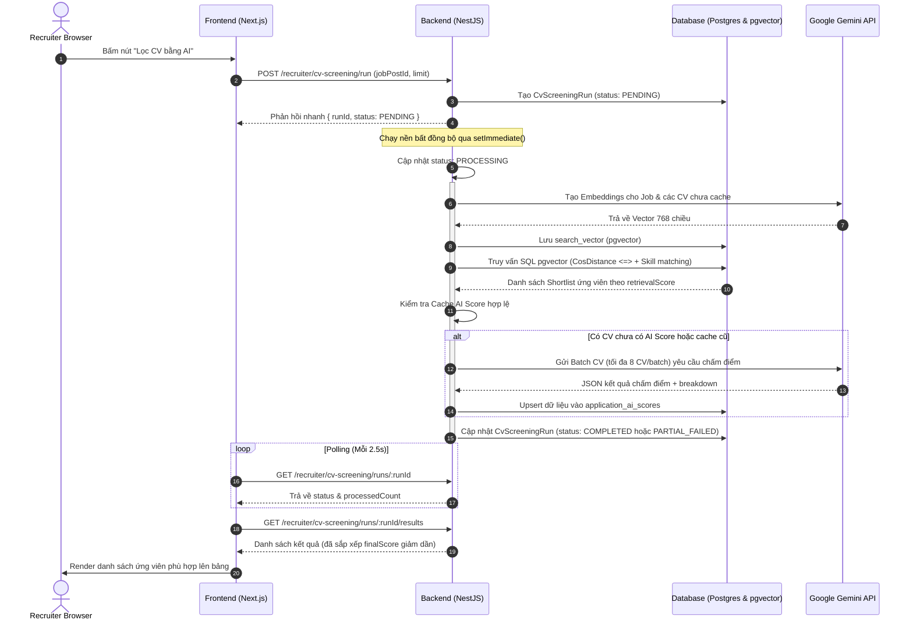
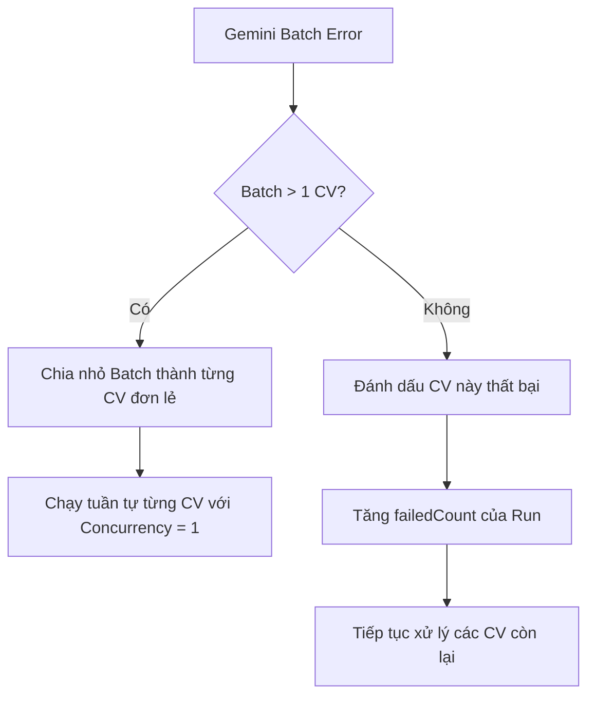

# Luồng kỹ thuật Lọc CV bằng AI (AI CV Screening Flow)

Tài liệu này mô tả chi tiết luồng kỹ thuật của tính năng **Lọc CV bằng AI** từ Giao diện Recruiter (Frontend) đến Xử lý nghiệp vụ ở NestJS (Backend), lưu trữ cơ sở dữ liệu PostgreSQL/pgvector, chấm điểm chi tiết bằng Gemini và hiển thị kết quả.

---

## 1. Bản đồ File quan trọng

### 1.1. Backend (`upnext-be`)

| Chức năng                   | File                                                                                                  |
| :-------------------------- | :---------------------------------------------------------------------------------------------------- |
| **API Controller**          | [cv-screening.controller.ts](file:///d:/upnextbe/src/modules/cv-screening/cv-screening.controller.ts) |
| **Điều phối Run (Service)** | [cv-screening.service.ts](file:///d:/upnextbe/src/modules/cv-screening/cv-screening.service.ts)       |
| **Embedding & pgvector**    | [embedding.service.ts](file:///d:/upnextbe/src/modules/cv-screening/embedding.service.ts)             |
| **Gemini Detailed Scoring** | [gemini-scoring.service.ts](file:///d:/upnextbe/src/modules/cv-screening/gemini-scoring.service.ts)   |
| **Bản định nghĩa Rubric**   | [scoring-rubric.ts](file:///d:/upnextbe/src/modules/cv-screening/scoring-rubric.ts)                   |
| **Database Schema**         | [schema.prisma](file:///d:/upnextbe/prisma/schema.prisma)                                             |

### 1.2. Frontend (`upnext-frontend`)

| Chức năng                    | File                                                                                                                                         |
| :--------------------------- | :------------------------------------------------------------------------------------------------------------------------------------------- |
| **API Endpoints Wrapper**    | [cv-screening-api.ts](file:///c:/Users/Admin/Downloads/upnext2/src/features/recruiter/api/cv-screening-api.ts)                               |
| **State, Polling & Session** | [use-cv-screening.ts](file:///c:/Users/Admin/Downloads/upnext2/src/features/recruiter/hooks/use-cv-screening.ts)                             |
| **Bảng AI & Danh sách**      | [recruiter-candidates-page.tsx](file:///c:/Users/Admin/Downloads/upnext2/src/features/recruiter/components/recruiter-candidates-page.tsx)    |
| **Trang đánh giá chi tiết**  | [candidate-evaluation-page.tsx](file:///c:/Users/Admin/Downloads/upnext2/src/features/recruiter/components/candidate-evaluation-page.tsx)    |
| **Route trang đánh giá**     | [page.tsx](<file:///c:/Users/Admin/Downloads/upnext2/src/app/[locale]/(workspace)/recruiter/candidates/[applicationId]/evaluation/page.tsx>) |

---

## 2. Kiến trúc & Luồng dữ liệu (Dataflow)

Quá trình lọc CV bằng AI bao gồm 3 giai đoạn chính:

1. **Semantic Retrieval (Truy xuất ngữ nghĩa):** Chuyển đổi Tin tuyển dụng & CV thành vector 768 chiều bằng Model `gemini-embedding-001`. Sử dụng extension `pgvector` trên PostgreSQL để thực hiện tìm kiếm khoảng cách Cosine.
2. **Structured Skill Reranking (Xếp hạng theo kỹ năng):** Lọc theo các kỹ năng bắt buộc và số năm kinh nghiệm để đưa ra danh sách rút gọn (Shortlist).
3. **AI Detailed Scoring (Chấm điểm chi tiết):** Sử dụng Model `gemini-2.5-flash` phân tích nội dung, đối soát bằng chứng trong CV và chấm điểm theo Rubric 100 điểm.



---

## 3. Thiết kế Database & pgvector

### 3.1. Cấu hình pgvector & HNSW Index

Hệ thống sử dụng PostgreSQL extension `vector`. Cột chứa vector có kiểu dữ liệu là `vector(768)`.
Để tối ưu hóa hiệu năng truy vấn trên lượng dữ liệu lớn, các HNSW Index sau được áp dụng:

```sql
CREATE EXTENSION IF NOT EXISTS vector;

-- Thêm cột vector vào bảng job_embeddings và cv_embeddings
ALTER TABLE "job_embeddings" ADD COLUMN "embedding_pgvector" vector(768);
ALTER TABLE "cv_embeddings" ADD COLUMN "embedding_pgvector" vector(768);

-- HNSW Index hỗ trợ khoảng cách Cosine (vector_cosine_ops)
CREATE INDEX IF NOT EXISTS "job_embeddings_search_vector_hnsw_idx"
ON "job_embeddings" USING hnsw ("embedding_pgvector" vector_cosine_ops);

CREATE INDEX IF NOT EXISTS "cv_embeddings_search_vector_hnsw_idx"
ON "cv_embeddings" USING hnsw ("embedding_pgvector" vector_cosine_ops);
```

### 3.2. Cấu trúc các bảng Database

#### Bảng `cv_screening_runs` (Phiên chạy lọc CV)

Lưu trữ thông tin của mỗi lần chạy lọc CV.

- `id` (UUID, PK)
- `jobPostId` (UUID, FK) - Liên kết tới Job được lọc.
- `companyId` (UUID) - Tránh rò rỉ dữ liệu giữa các công ty.
- `recruiterAccountId` (UUID) - Người thực hiện chạy lọc.
- `totalApplications` (Int) - Tổng số CV nộp vào tại thời điểm chạy.
- `processedCount` (Int) - Số CV đã được chấm điểm chi tiết (hoặc lấy từ cache).
- `failedCount` (Int) - Số lượng CV bị lỗi trong quá trình xử lý.
- `limit` (Int, Nullable) - Giới hạn số CV tối đa đưa vào chấm chi tiết.
- `minScore` (Float, Nullable) - Ngưỡng điểm retrieval tối thiểu để chấm AI.
- `status` (Enum) - Trạng thái phiên: `PENDING`, `PROCESSING`, `COMPLETED`, `PARTIAL_FAILED`, `FAILED`.
- `errorMessage` (String, Nullable) - Chi tiết lỗi cấp hệ thống.

#### Bảng `job_embeddings` & `cv_embeddings` (Lưu cache vector)

- `id` (UUID, PK)
- `jobPostId` / `cvVersionId` (UUID, Unique FK)
- `embeddingText` (Text) - Nội dung thô dùng để sinh vector.
- `embeddingVector` (JSONB) - Dùng để tương thích ngược.
- `embedding_pgvector` (vector(768)) - Cột vector thực tế dùng cho pgvector.
- `modelName` (String) - Nhãn cache model (mặc định: `gemini-embedding-001:768:l2-v1`).
- `updatedAt` (DateTime) - Dùng kiểm chứng tính mới của cache.

#### Bảng `application_ai_scores` (Điểm số chi tiết)

- `applicationId` (UUID, PK) - Mỗi Application chỉ lưu một kết quả chấm điểm mới nhất.
- `runId` (UUID, FK) - Phiên chạy tạo ra điểm này.
- `semanticScore` (Float) - Điểm tương đồng ngữ nghĩa.
- `skillMatchScore` (Float) - Điểm khớp kỹ năng bắt buộc (hệ thống tự tính).
- `retrievalScore` (Float) - Điểm hybrid retrieval dùng lọc shortlist.
- `aiScore` (Float) - Tổng điểm chi tiết từ 4 nhóm tiêu chí của Gemini.
- `finalScore` (Float) - Điểm số xếp hạng cuối cùng.
- `skillScore`, `experienceScore`, `projectScore`, `educationScore` (Float) - Điểm số thành phần.
- `matchedSkills`, `missingSkills` (JSONB) - Danh sách kỹ năng khớp và thiếu.
- `strengths`, `weaknesses` (JSONB) - Điểm mạnh và điểm cần lưu ý dạng text array.
- `summary` (Text) - Nhận xét tổng quan.
- `recommendation` (String) - Phân loại: `strong_fit`, `fit`, `borderline`, `not_fit`.
- `rawAiResponse` (JSONB) - Chứa `criteriaBreakdown` thô từ Gemini để render lý do chi tiết.
- `modelName`, `scoringVersion` (String) - Khóa xác định cache AI Score (mặc định: `gemini-2.5-flash` và `cv-screening-v7-explainable-rubric-vi`).

---

## 4. Đặc tả API Contract

Tất cả các API Recruiter đều được bảo vệ bởi `JwtAuthGuard` và `RolesGuard` (chỉ chấp nhận vai trò `RECRUITER`), sử dụng URL prefix `/api/v1`.

### 4.1. Khởi tạo phiên lọc CV (Start Run)

- **Endpoint:** `POST /api/v1/recruiter/cv-screening/run`
- **Payload:**
  ```json
  {
    "jobPostId": "8e10280c-ae2d-4579-a048-c25279447a3e",
    "limit": 100,
    "minScore": 0
  }
  ```
- **Response:** (201 Created)
  ```json
  {
    "runId": "9c12b224-8d60-4d58-a9f8-0ae5fc74b0f4",
    "status": "PENDING"
  }
  ```

### 4.2. Lấy trạng thái phiên chạy (Poll Status)

- **Endpoint:** `GET /api/v1/recruiter/cv-screening/runs/:runId`
- **Response:** (200 OK)
  ```json
  {
    "id": "9c12b224-8d60-4d58-a9f8-0ae5fc74b0f4",
    "jobPostId": "8e10280c-ae2d-4579-a048-c25279447a3e",
    "totalApplications": 180,
    "processedCount": 64,
    "failedCount": 1,
    "limit": 100,
    "minScore": 0,
    "status": "PROCESSING",
    "errorMessage": null,
    "startedAt": "2026-07-19T09:00:01.000Z",
    "finishedAt": null
  }
  ```

### 4.3. Lấy kết quả bảng xếp hạng (Get Results)

- **Endpoint:** `GET /api/v1/recruiter/cv-screening/runs/:runId/results`
- **Response:** (200 OK) - Trả về mảng đã được sắp xếp theo `finalScore DESC`
  ```json
  [
    {
      "applicationId": "0dcf9539-df15-4e25-ad08-460ed663e585",
      "candidateName": "Nguyễn Văn A",
      "jobTitle": "Senior Java Backend Engineer",
      "finalScore": 85.5,
      "semanticScore": 79,
      "aiScore": 85.5,
      "skillScore": 35,
      "experienceScore": 27,
      "projectScore": 16,
      "educationScore": 7.5,
      "matchedSkills": ["Java", "Spring Boot", "PostgreSQL"],
      "missingSkills": ["Kafka"],
      "summary": "Ứng viên có nền tảng backend phù hợp và kinh nghiệm thực tế tốt.",
      "recommendation": "Phù hợp",
      "cvFileUrl": "/api/v1/recruiter/applications/0dcf9539-df15-4e25-ad08-460ed663e585/cv"
    }
  ]
  ```

### 4.4. Lấy chi tiết điểm số & Breakdown (Get AI Score)

- **Endpoint:** `GET /api/v1/recruiter/applications/:applicationId/ai-score`
- **Response:** (200 OK)
  ```json
  {
    "id": "uuid",
    "applicationId": "0dcf9539-df15-4e25-ad08-460ed663e585",
    "candidateName": "Nguyễn Văn A",
    "jobTitle": "Senior Java Backend Engineer",
    "finalScore": 85.5,
    "semanticScore": 79.0,
    "aiScore": 85.5,
    "skillScore": 35.0,
    "experienceScore": 27.0,
    "projectScore": 16.0,
    "educationScore": 7.5,
    "strengths": ["Có kinh nghiệm triển khai microservices", "Thành thạo Spring Boot"],
    "weaknesses": ["Kinh nghiệm làm việc với Message Queue (Kafka) còn hạn chế"],
    "summary": "Ứng viên có nền tảng backend phù hợp...",
    "recommendation": "Phù hợp",
    "matchedSkills": ["Java", "Spring Boot"],
    "missingSkills": ["Kafka"],
    "criteriaBreakdown": [
      {
        "key": "skills",
        "summary": "Ứng viên có kỹ năng tốt về Backend Java nhưng cần bổ sung công cụ phân tán.",
        "items": [
          {
            "key": "required-skills",
            "awardedScore": 17,
            "reason": "Thiếu Kafka và Redis.",
            "evidence": "CV ghi nhận Java, Spring Boot, MySQL."
          }
        ]
      }
    ],
    "evaluationRubric": [
      /* Rubric mẫu toàn bộ 100 điểm để hiển thị tooltip */
    ],
    "cvFileUrl": "/api/v1/recruiter/applications/0dcf9539-df15-4e25-ad08-460ed663e585/cv"
  }
  ```

### 4.5. Stream File CV gốc (Stream CV)

- **Endpoint:** `GET /api/v1/recruiter/applications/:applicationId/cv`
- **Mô tả:** Backend xác thực quyền Recruiter, stream trực tiếp file nhị phân CV với Header `Content-Disposition: inline` để hiển thị trên trình duyệt.

---

## 5. Pipeline CV Screening tại Backend

### Giai đoạn 1: Chuẩn bị & Chuẩn hóa Text

#### Tin tuyển dụng (Job Text)

Được tổng hợp có cấu trúc từ database:

```txt
Job title: [Title]
Category: [JobCategory]
Employment type: [EmploymentType]
Experience level: [ExperienceLevel]
Education level: [EducationLevel]
Working days: [WorkingDays]
Description: [Description]
Requirements: [Requirements]
Benefits: [Benefits]
Required skills: [Skill 1 name (priority: REQUIRED, level: SENIOR, min years: 3), ...]
Specializations: [Specializations]
Locations: [Locations]
```

Văn bản được xóa bỏ khoảng trắng thừa, giới hạn tối đa 12.000 ký tự cho embedding và 8.000 ký tự cho detailed prompt.

#### Hồ sơ ứng viên (CV Text)

Hệ thống ưu tiên sử dụng trường `CVVersion.parsedText` (văn bản được trích xuất từ file PDF/Docx khi ứng tuyển). Nếu trường này rỗng, hệ thống sẽ tự động ghép thông tin từ Candidate Profile có cấu trúc (học vấn, dự án, kinh nghiệm làm việc, kỹ năng, chứng chỉ).
Giới hạn tối đa 12.000 ký tự cho embedding và 6.000 ký tự cho detailed prompt. Nếu vượt quá giới hạn, hệ thống cắt giữa bằng chuỗi `...[đã rút gọn]...` và giữ lại phần đầu/phần cuối.

---

### Giai đoạn 2: Tạo Embeddings & L2 Normalization

Sử dụng model `gemini-embedding-001` với số chiều cố định là 768.

Do model này không tự động chuẩn hóa vector ở các số chiều nhỏ hơn mặc định, Backend thực hiện **L2 Normalization**:
$$\vec{v}_{normalized} = \frac{\vec{v}}{\|\vec{v}\|_2} = \frac{\vec{v}}{\sqrt{\sum_{i=1}^{n} v_i^2}}$$

- **Concurrency:** Quá trình sinh embedding cho các CV được chạy song song tối đa 8 luồng (`EMBEDDING_CONCURRENCY = 8`).
- **Retry:** Tự động retry tối đa 3 lần nếu Google API gặp lỗi mạng hoặc quá tải (delay tăng dần 500ms, 1000ms).

---

### Giai đoạn 3: pgvector Semantic Retrieval & Hybrid Reranking

#### 1. Semantic Similarity

Sử dụng toán tử `<=>` (Cosine Distance) của pgvector:
$$\text{semanticSimilarity} = 1 - \text{cosineDistance}$$
$$\text{semanticScore} = \text{semanticSimilarity} \times 100$$

#### 2. Structured Skill Matching

Hệ thống tính điểm khớp kỹ năng bắt buộc (Priority `REQUIRED` trong job):

- Ứng viên không có kỹ năng: **Hệ số = 0**
- Có kỹ năng, job không yêu cầu số năm kinh nghiệm tối thiểu: **Hệ số = 1.0**
- Có kỹ năng và đủ số năm kinh nghiệm tối thiểu: **Hệ số = 1.0**
- Có kỹ năng nhưng thiếu số năm kinh nghiệm: **Hệ số = 0.65**

$$\text{skillSimilarity} = \frac{\sum \text{Hệ số}}{\text{Số lượng kỹ năng bắt buộc}}$$
$$\text{skillMatchScore} = \text{skillSimilarity} \times 100$$
_(Nếu Job không có kỹ năng bắt buộc nào, `skillMatchScore` mặc định lấy bằng `semanticScore`)_.

#### 3. Hybrid Rerank Score

$$\text{retrievalScore} = (\text{semanticScore} \times 0.85) + (\text{skillMatchScore} \times 0.15)$$

Backend thực hiện thiết lập cấu hình tìm kiếm HNSW động trong transaction:

```sql
SET LOCAL hnsw.ef_search = 160;
SET LOCAL hnsw.iterative_scan = strict_order;
```

Lấy danh sách ứng viên có `retrievalScore >= minScore`, sắp xếp theo `retrievalScore DESC`, lấy tối đa `limit` bản ghi (mặc định 100, max 200) để chuyển sang Giai đoạn 4.

---

### Giai đoạn 4: Chấm điểm bằng Gemini 2.5 Flash

#### 1. Cơ chế Cache AI Score

Để tiết kiệm chi phí API và tăng tốc độ xử lý, Backend sẽ kiểm tra xem ứng viên đã có điểm số hợp lệ từ trước chưa. Điểm số được coi là hợp lệ khi:

- `modelName === 'gemini-2.5-flash'`
- `scoringVersion === 'cv-screening-v7-explainable-rubric-vi'`
- Thời gian cập nhật `updatedAt` của AI Score lớn hơn hoặc bằng thời gian cập nhật của cả Job Embedding và CV Embedding.

Nếu thỏa mãn, điểm số cũ được tái sử dụng và cập nhật `runId` mới mà không cần gọi lại Gemini API.

#### 2. Batch Scoring & Configuration

Các ứng viên chưa có cache hợp lệ sẽ được chia thành các Batch (tối đa 8 CV/batch) và gửi đến Gemini 2.5 Flash với tham số cấu hình:

- `temperature`: 0 (đảm bảo tính nhất quán của điểm số).
- `topP`: 0.1
- `responseMimeType`: `'application/json'`
- Bắt buộc tuân thủ đúng định dạng JSON Schema định nghĩa trong code.

---

### Giai đoạn 5: Rubric Chấm điểm & Công thức cuối cùng

#### 1. Bảng Rubric 100 điểm (`scoring-rubric.ts`)

| Tiêu chí chính                   | Trọng số tối đa | Hạng mục con                                         | Điểm tối đa con |
| :------------------------------- | :-------------- | :--------------------------------------------------- | :-------------- |
| **Kỹ năng (`skills`)**           | **40 điểm**     | Kỹ năng bắt buộc (`required-skills`)                 | 20 điểm         |
|                                  |                 | Kỹ năng ưu tiên và công cụ (`preferred-skills`)      | 8 điểm          |
|                                  |                 | Độ thành thạo và seniority (`proficiency`)           | 8 điểm          |
|                                  |                 | Bối cảnh áp dụng kỹ năng (`skill-context`)           | 4 điểm          |
| **Kinh nghiệm (`experience`)**   | **30 điểm**     | Số năm kinh nghiệm liên quan (`relevant-years`)      | 12 điểm         |
|                                  |                 | Độ tương đồng vai trò (`role-similarity`)            | 8 điểm          |
|                                  |                 | Domain và mức trách nhiệm (`domain-responsibility`)  | 6 điểm          |
|                                  |                 | Độ gần đây và liên tục (`recency-continuity`)        | 4 điểm          |
| **Dự án liên quan (`projects`)** | **20 điểm**     | Mức liên quan của dự án (`project-relevance`)        | 8 điểm          |
|                                  |                 | Độ sâu kỹ thuật (`technical-depth`)                  | 5 điểm          |
|                                  |                 | Tác động và quy mô (`impact-scale`)                  | 4 điểm          |
|                                  |                 | Chất lượng bằng chứng (`evidence-quality`)           | 3 điểm          |
| **Học vấn (`education`)**        | **10 điểm**     | Bằng cấp và chuyên ngành (`degree-major`)            | 5 điểm          |
|                                  |                 | Chứng chỉ và đào tạo (`certifications`)              | 3 điểm          |
|                                  |                 | Bằng chứng học thuật liên quan (`academic-evidence`) | 2 điểm          |

#### 2. Chuẩn hóa & Lưu điểm

- Điểm số của mỗi nhóm tiêu chí (`skillScore`, `experienceScore`, `projectScore`, `educationScore`) được backend tính toán lại bằng tổng điểm của các hạng mục con do Gemini trả về nhằm đảm bảo độ chính xác.
- Backend tự động làm tròn điểm số đến 2 chữ số thập phân và clamp điểm số trong khoảng $[0, \text{Max}]$.
- Điểm AI Score tổng:
  $$\text{aiScore} = \text{skillScore} + \text{experienceScore} + \text{projectScore} + \text{educationScore}$$
- Điểm số xếp hạng cuối cùng:
  $$\text{finalScore} = \text{aiScore}$$
  _(Hệ thống đã loại bỏ công thức hybrid cũ `0.7 _ aiScore + 0.3 _ retrievalScore` để đồng bộ hoàn toàn với yêu cầu "Tổng điểm xếp hạng bằng tổng 4 nhóm tiêu chí")_.

#### 3. Xếp loại Khuyến nghị (`recommendation`)

Được phân loại tự động dựa trên `finalScore`:

- $\ge 85$: **Rất phù hợp** (`strong_fit`)
- $70 \rightarrow 84$: **Phù hợp** (`fit`)
- $50 \rightarrow 69$: **Cần cân nhắc** (`borderline`)
- $< 50$: **Không phù hợp** (`not_fit`)

---

## 6. Tích hợp Frontend (Next.js)

### 6.1. Quản lý State & Polling qua Hook `useCvScreening`

Hook `useCvScreening` đóng vai trò quản lý vòng đời chạy lọc và đồng bộ trạng thái giữa các tab trên giao diện Recruiter.

#### Cơ chế Session Storage Cache

Khi nhà tuyển dụng chuyển trang hoặc tải lại trang, các thông tin lọc hiện tại được khôi phục từ `sessionStorage`:

- `upnext_rankingTempJobId`: Job ID đang được chọn lọc.
- `upnext_rankingTempLimit`: Giới hạn limit đang chọn.
- `upnext_rankingHasFiltered`: Đã thực hiện chạy lọc trong phiên làm việc chưa (`'true'` / `'false'`).
- `upnext_rankingRunId`: ID của run hiện tại (dùng để khôi phục quá trình polling khi F5).
- `upnext_rankingRunStatus`: Trạng thái run cuối cùng ghi nhận ở frontend.
- `upnext_rankingResults`: JSON lưu danh sách kết quả bảng xếp hạng đã tải về.
- `upnext_activeTab`: Tab đang active trên trang quản lý candidates (mở đúng tab `cv-ranking` khi quay lại).

#### Logic Polling trạng thái

Khi nhận được `runId` với status `PENDING` hoặc `PROCESSING`, hook bắt đầu kích hoạt vòng lặp `setInterval` định kỳ **2.5 giây**:

1. Gọi `GET /recruiter/cv-screening/runs/:runId`.
2. Cập nhật thanh tiến trình (`progress`) thông qua `processedCount` và `failedCount`.
3. Nếu status chuyển sang `COMPLETED` hoặc `PARTIAL_FAILED`: dừng interval, gọi API kết quả kết xuất bảng xếp hạng.
4. Nếu status chuyển sang `FAILED`: dừng interval, hiển thị lỗi hệ thống.

---

### 6.2. Trang đánh giá chi tiết Ứng viên (`CandidateEvaluationPage`)

Nhà tuyển dụng truy cập trang đánh giá chi tiết thông qua liên kết:
`/[locale]/recruiter/candidates/[applicationId]/evaluation`

Trang này phân tách lý do chấm điểm thành 4 Tab tương ứng với 4 nhóm tiêu chí trong Rubric.

#### 1. Đối sánh Breakdown với Rubric

Frontend so khớp giữa kết quả thực tế của ứng viên (`criteriaBreakdown`) và mẫu Rubric chuẩn (`evaluationRubric`) thông qua trường `key` của hạng mục con để hiển thị:

- Tiêu đề hạng mục con.
- Điểm số đạt được / Điểm số tối đa của hạng mục đó.
- Điểm bị trừ (tự động tính: $\text{deduction} = \text{maxScore} - \text{awardedScore}$).
- Lý do chi tiết từ AI và Bằng chứng cụ thể trích xuất từ CV.

#### 2. Thao tác trên Sidebar

- **Xem CV:** Sử dụng cơ chế Blob URL an toàn. Hệ thống gọi API `GET /applications/:applicationId/cv` đính kèm Token xác thực, nhận dữ liệu nhị phân (Blob), tạo URL nội bộ qua `URL.createObjectURL(blob)` rồi hiển thị CV sang tab mới.
- **Thay đổi trạng thái:** Cho phép tuyển dụng bấm nút "Từ chối" hoặc "Mời phỏng vấn". Hệ thống tự động cập nhật trạng thái hồ sơ về Database, đồng thời xóa cache kết quả cũ trong `sessionStorage` của ứng viên đó để tránh dữ liệu bị lỗi thời (stale).

---

## 7. Cơ chế Xử lý lỗi & Fallback

Hệ thống thiết lập các chốt chặn lỗi chặt chẽ từ Backend đến Frontend để đảm bảo tiến trình lọc không bị gián đoạn hoàn toàn:



- **Lỗi Embedding từng CV:** Nếu một CV gặp lỗi định dạng hoặc trích xuất text không tạo được embedding, tiến trình ghi nhận log, tăng `failedCount` của Run và bỏ qua CV đó. Run vẫn tiếp tục chạy cho các ứng viên khác thay vì hủy bỏ toàn bộ.
- **Lỗi Gemini Batch:** Nếu batch 8 CV gặp lỗi (Quota rate limit, lỗi định dạng), hệ thống tự động fallback: Chia nhỏ batch thành từng CV và chạy tuần tự riêng biệt với `concurrency = 1` để cứu các CV hợp lệ còn lại.
- **Unauthorized (401):** Frontend wrapper `recruiterApiRequest` lắng nghe mã lỗi 401, tự động kích hoạt tiến trình refresh token qua API `/recruiter/auth/refresh` và retry request gốc đúng một lần. Nếu refresh thất bại, xóa session và chuyển hướng về `/recruiter/login`.
- **Stale Application (404):** Trong trường hợp nhà tuyển dụng xem chi tiết ứng viên đã bị xóa hoặc không còn tồn tại trên kết quả run hiện tại, trang đánh giá tự động dọn dẹp ID ứng viên đó khỏi `sessionStorage` và hiển thị thông báo yêu cầu chạy lọc lại.

---

## 8. Lệnh kiểm tra và xác minh hệ thống

### 8.1. Kiểm thử Frontend (TypeScript & E2E)

```powershell
# Kiểm tra lỗi biên dịch TypeScript
pnpm exec tsc --noEmit --pretty false

# Chạy Unit test cho Hook CV Screening
pnpm exec vitest run src/features/recruiter/hooks/use-cv-screening.test.tsx

# Chạy E2E test cho Giao diện Bảng xếp hạng và Đánh giá chi tiết
pnpm exec playwright test e2e/recruiter-ai-score-dialog.spec.ts --project=chromium
```

### 8.2. Kiểm thử Backend (NestJS & DB)

```powershell
# Biên dịch toàn bộ Backend
npm run build

# Chạy Unit & Integration tests cho Module CV screening
npm test -- cv-screening
```

---

## 9. Nợ kỹ thuật & Khuyến nghị Cải tiến

Hệ thống hiện tại hoạt động ổn định nhưng có các điểm hạn chế kỹ thuật cần được tối ưu hóa trong các phiên bản tiếp theo:

1. **Kiến trúc xử lý bất đồng bộ (setImmediate):**
   - _Hạn chế:_ Backend sử dụng `setImmediate()` để kích hoạt tiến trình xử lý nền NestJS. Nếu máy chủ bị khởi động lại (restart/deploy) trong lúc đang chạy lọc CV, tiến trình sẽ bị ngắt quãng giữa chừng khiến Run bị kẹt vĩnh viễn ở trạng thái `PROCESSING`.
   - _Khuyến nghị:_ Chuyển luồng xử lý nền sang hệ thống hàng đợi tin nhắn bền vững (Durable Queue) như **BullMQ / Redis** để đảm bảo tính an toàn dữ liệu và có khả năng phục hồi khi hệ thống gặp sự cố.
2. **Khóa chống trùng lắp (Idempotency Lock):**
   - _Hạn chế:_ Chưa có cơ chế khóa (locking) ngăn chặn việc nhà tuyển dụng nhấn nút chạy lọc nhiều lần đồng thời cho cùng một Job, dẫn đến lãng phí tài nguyên tính toán và chi phí gọi API Gemini.
   - _Khuyến nghị:_ Bổ sung cơ chế khóa phân tán (Distributed Lock) dựa trên Job ID khi bắt đầu chạy lọc.
3. **Trường dữ liệu dư thừa trong Frontend Types:**
   - _Hạn chế:_ Các interface `CvScreeningResultItem` và `ApplicationAiScoreResponse` ở frontend vẫn định nghĩa các trường cũ không còn sử dụng như `skillMatchScore` và `retrievalScore` (cho mục đích hiển thị trực diện trên bảng xếp hạng).
   - _Khuyến nghị:_ Thực hiện làm sạch và đồng bộ hóa các Types của Frontend để phản ánh chính xác các trường dữ liệu thực tế do API Backend trả về.
