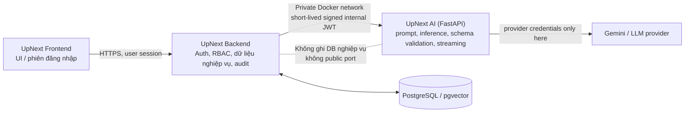

# Bàn giao nền tảng AI UpNext

> Cập nhật: 15/08/2026  
> Phạm vi: `upnext-frontend`, `upnext-be`, `upnext-ai`, `upnext-infra`  
> Mục tiêu: giúp Agent tiếp theo tiếp tục an toàn việc tách dần các năng lực AI khỏi backend sang dịch vụ `upnext-ai`.

## 1. Đọc trước khi thực hiện

- Không đọc, sửa hoặc chạy bất kỳ thứ gì trong thư mục `recruitsmart-full`.
- Không reset, clean, checkout hay ghi đè các worktree đang bẩn. Những thay đổi cục bộ hiện có thuộc về người dùng hoặc tác vụ khác.
- Không đưa API key, JWT secret, Cloudinary key, token GitHub/GHCR, CV, prompt hoặc dữ liệu ứng viên vào Git, log, ảnh chụp, issue hay tài liệu.
- Không chạy `docker compose down`, `--remove-orphans`, xoá container/volume diện rộng trên VPS. VPS đang có cả các container production và staging cùng tồn tại.
- Frontend **không bao giờ** gọi `upnext-ai` trực tiếp. Mọi AI request đi theo `Frontend → Backend → AI service`.

## 2. Kiến trúc đích đã thống nhất



### Trách nhiệm bắt buộc

| Thành phần     | Được làm                                                                                                     | Không được làm                                                            |
| -------------- | ------------------------------------------------------------------------------------------------------------ | ------------------------------------------------------------------------- |
| Frontend       | hiển thị trạng thái, gửi yêu cầu người dùng, hiển thị stream                                                 | gọi AI nội bộ, giữ provider key, tự quyết định quyền truy cập             |
| Backend        | xác thực/RBAC, lấy context tối thiểu, tool/business logic, audit, feature flag/canary, DB write              | lộ provider key hoặc cho AI ghi DB trực tiếp                              |
| `upnext-ai`    | adapter provider, prompt/version, output schema, retry/timeout, embeddings/inference, telemetry đã redaction | public Internet route, business authorization, dữ liệu bền vững nghiệp vụ |
| Infrastructure | private network, secrets/health/resource limit/image rollout                                                 | mở port/Nginx cho AI service                                              |

## 3. Trạng thái đã làm

### 3.1 Hạ tầng và gateway

| Hạng mục                    | Trạng thái                                | Bằng chứng / lưu ý                                                                                                   |
| --------------------------- | ----------------------------------------- | -------------------------------------------------------------------------------------------------------------------- |
| Repo FastAPI `upnext-ai`    | Đã tạo                                    | Repo riêng ngang cấp FE/BE/infra; có Dockerfile, health endpoints, contract export, pytest/ruff/pyright.             |
| Dịch vụ AI staging private  | Đã merge ở Infra PR #1                    | Có profile `ai`, không publish host port và không có Nginx route. Chỉ backend staging được gọi qua Docker network.   |
| AI gateway trong BE         | Đã merge ở BE PR #133 và các PR tiếp theo | BE ký JWT nội bộ ngắn hạn; AI xác minh issuer/audience/environment/scope.                                            |
| Tách Candidate Copilot      | Đã triển khai theo capability             | Luồng candidate copilot đi qua gateway riêng, không nên gọi trực tiếp LLM từ UI.                                     |
| Chuẩn hoá structured output | Đã có nhánh/commit sửa                    | Có thay đổi tương thích JSON Schema của Gemini; cần xác minh image chứa thay đổi đó đã thật sự được rollout staging. |
| CV screening batch          | Đã merge theo chuỗi AI PR #4 / BE PR #143 | Đi theo capability riêng, không di chuyển hàng loạt.                                                                 |
| Embeddings                  | Đã merge theo chuỗi AI PR #5 / BE PR #144 | Có private embedding gateway và fallback được cấu hình.                                                              |
| Trích xuất dữ liệu JD       | Đã merge theo chuỗi AI PR #6 / BE PR #145 | Có capability extraction riêng và canary ở BE.                                                                       |

### 3.2 Staging đã xác minh trực tiếp

Các kiểm tra sau đã từng thành công trên VPS `/opt/upnext`:

- `upnext-ai-staging` chạy `healthy`.
- `upnext-backend-staging` chạy `healthy`; `/health` trả database OK.
- Backend gọi được `http://ai-staging:8000/health/live` và nhận HTTP 200.
- Backend và AI cùng `APP_ENV/AI_ENVIRONMENT=staging`; fingerprint SHA-256 của `AI_INTERNAL_JWT_SECRET` trùng khớp.
- Sau khi tái tạo bằng Compose project `upnext`, cả AI và backend cùng mạng `upnext_upnext-staging`.
- Đã tạo backup PostgreSQL hợp lệ trước thao tác recovery:  
  `/opt/upnext/backups/upnext-staging-before-pgvector-recovery-20260811T080949Z.dump`  
  (file backup 0 byte cùng tên thời điểm sớm hơn phải bỏ qua).

### 3.3 Migrations pgvector

Đã xảy ra sự cố P3009/P3012 trong giai đoạn deploy pgvector. Sau recovery, `_prisma_migrations` từng có:

- Một bản ghi migration `20260719090000_use_pgvector_for_cv_screening` đã rolled back, `applied_steps_count = 0`.
- Một bản ghi cùng migration hoàn thành, `applied_steps_count = 1`.

Điều này **không tự động chứng minh** staging hiện hoàn toàn sạch. Agent tiếp theo phải chạy `prisma migrate status` bằng image/backend hiện hành trước mọi rollout AI mới.

## 4. Những gì chưa hoàn thành hoặc chưa được chứng minh

### P0 — cần xử lý trước khi gọi staging là production-ready

1. **Candidate Copilot trên staging vẫn trả `AI_INVALID_OUTPUT`.**
   - Đã xác minh đây không phải lỗi network/JWT: backend gọi được AI, secret và environment khớp.
   - Một direct internal request tới `/internal/v1/llm/structured` trả HTTP 502 `AI_INVALID_OUTPUT`.
   - Log AI cho thấy Gemini `gemini-2.5-flash-lite:generateContent` trả HTTP 400.
   - Health check chỉ chứng minh process/config sẵn sàng; không chứng minh provider có thể hoàn tất structured generation.
   - Cần xác minh deployed image có commit normalizer mới, đọc response provider đã redaction để phân loại chính xác lỗi schema/model/key/quota, rồi thực hiện smoke test thật.

2. **Nhánh AI tạo JD vẫn có CI lỗi.**
   - Nhánh: `codex/job-post-generation-ai`, commit đã thấy: `36894b7`.
   - Nguyên nhân đã xác định: `ruff` line-length 100, trong `app/contracts/job_post.py` có dòng `execution_profile` dài 102 ký tự.
   - Cách sửa tối thiểu:

```python
execution_profile: Literal["interactive"] = Field(
    default="interactive", alias="executionProfile"
)
```

- Sau sửa phải chạy đầy đủ `ruff check .`, `ruff format --check .`, `pyright`, `pytest`, export contract check và Docker build; không merge chỉ vì sửa được CI.

3. **Chưa có bằng chứng E2E staging cho từng capability mới.**
   - Cần có test thực từ UI/BE cho Copilot, CV screening, embeddings và JD extraction/generation theo đúng feature flag/canary.
   - Không coi `/health/ready` là kiểm thử chức năng AI.

### P1 — cần triển khai có kế hoạch

| Capability AI            | Trạng thái                               | Việc cần làm                                                                                   |
| ------------------------ | ---------------------------------------- | ---------------------------------------------------------------------------------------------- |
| Candidate Copilot        | Gateway đã có, staging provider đang lỗi | Fix provider/schema rollout; canary, metrics và E2E.                                           |
| CV screening             | Đã có route/batch tách riêng             | Kiểm tra cờ canary, fallback, scoring parity và cập nhật tài liệu cũ còn gọi Gemini trực tiếp. |
| Embeddings               | Đã qua private gateway                   | Kiểm chứng index/query, timeout 20s, fallback và chi phí.                                      |
| JD extraction            | Đã có capability riêng                   | Kiểm chứng input bound, schema, RBAC recruiter và fallback.                                    |
| JD generation            | Nhánh đang CI đỏ                         | Fix CI, review output policy/rate limit rồi rollout canary độc lập.                            |
| Salary research          | Chưa xác nhận đã tách                    | Lập capability riêng; không gom chung với JD generation.                                       |
| Company/license scanning | Chưa xác nhận đã tách                    | Lập threat/privacy review và contract riêng.                                                   |

Không được tuyên bố “đã tách toàn bộ AI”. Các service Gemini cũ trong BE phải được inventory từ `origin/dev` tại thời điểm bắt đầu tác vụ, vì các PR migration đã tiếp tục được merge sau các audit trước.

## 5. Trạng thái worktree khi bàn giao

> Các SHA/nhánh dưới đây chỉ là snapshot. Trước khi làm phải `git fetch --prune` và so sánh remote; không pull đè worktree bẩn.

| Repo                                  | Snapshot đã quan sát                                                                                                         | Cảnh báo                                                                           |
| ------------------------------------- | ---------------------------------------------------------------------------------------------------------------------------- | ---------------------------------------------------------------------------------- |
| `D:\Workspace\upnext\upnext-frontend` | Branch `codex/cv-builder-versioned-apply`, có thay đổi chưa commit ở `public-header.tsx`, thư mục AI interview và `.claude/` | Đây là thay đổi người dùng/tác vụ khác, không reset/commit kèm.                    |
| `D:\Workspace\upnext\upnext-backend`  | Branch local `codex/cv-builder-versioned-apply`, có `docker-compose.yml` bẩn                                                 | Luôn bắt đầu bằng worktree sạch/nhánh mới từ `origin/dev`; không sửa file bẩn này. |
| `D:\Workspace\upnext\upnext-ai`       | Branch `codex/normalize-gemini-json-schema`, lúc quan sát clean, HEAD `c6c3f9d`                                              | So sánh với `origin/develop`; đừng deploy branch cũ chưa chứa các routes mới.      |
| `D:\Workspace\upnext\upnext-infra`    | `main`, từng clean, HEAD `0894e51`                                                                                           | Dùng đúng Compose project name `upnext` trên VPS.                                  |

## 6. Cấu hình local chuẩn

### 6.1 Quy tắc địa chỉ service

| Cách chạy BE                                          | `AI_SERVICE_URL` phù hợp                                                                             |
| ----------------------------------------------------- | ---------------------------------------------------------------------------------------------------- |
| BE chạy trực tiếp trên máy host, AI FastAPI chạy host | `http://127.0.0.1:8000`                                                                              |
| BE chạy trong Docker Compose cùng AI                  | tên DNS service trên Docker network, ví dụ `http://upnext-ai:8000` (xác minh tên thực trong compose) |
| Staging Docker Compose                                | `http://ai-staging:8000`                                                                             |

`127.0.0.1` bên trong container là chính container đó, không phải máy host hay container AI khác.

### 6.2 Biến môi trường (chỉ tên biến)

Backend dùng gateway AI cần kiểm tra tên/giá trị với schema của `origin/dev`:

```dotenv
AI_LLM_PROVIDER=upnext-ai
AI_SERVICE_URL=http://127.0.0.1:8000
AI_INTERNAL_JWT_SECRET=<shared-secret-unique-to-be-and-ai>
AI_SERVICE_FALLBACK_TO_GEMINI=true

AI_EMBEDDING_PROVIDER=upnext-ai
AI_EMBEDDING_SERVICE_TIMEOUT_MS=20000
AI_EMBEDDING_FALLBACK_TO_GEMINI=true
```

AI service local:

```dotenv
AI_INTERNAL_JWT_SECRET=<exactly-the-same-shared-secret>
AI_ENVIRONMENT=development
AI_INTERNAL_JWT_ISSUER=upnext-be
AI_INTERNAL_JWT_AUDIENCE=upnext-ai
AI_INTERNAL_JWT_MAX_TTL_SECONDS=90
GEMINI_API_KEY=<provider-key>
AI_STRUCTURED_MODEL=gemini-2.5-flash-lite
AI_TEXT_MODEL=gemini-2.5-flash
```

Không tái sử dụng `JWT_ACCESS_SECRET` người dùng cho `AI_INTERNAL_JWT_SECRET`.

### 6.3 Lệnh kiểm tra local

Tại repo `upnext-ai` (Python 3.12):

```powershell
Copy-Item .env.example .env   # chỉ lần đầu; điền secret/key cục bộ
python -m venv .venv
.\.venv\Scripts\Activate.ps1
python -m pip install --upgrade pip
python -m pip install -e ".[dev]"
python -m pytest
ruff check .
ruff format --check .
pyright
python scripts/export_contracts.py --check
fastapi dev app/main.py
```

Khi test browser, chỉ coi capability hoạt động sau khi request trả lời hợp lệ, tool result đúng quyền, retry/fallback có UX tốt và không có dữ liệu riêng tư trong console/log.

## 7. Staging VPS: trạng thái và quy trình an toàn

### 7.1 Bối cảnh VPS

- Thư mục deploy: `/opt/upnext`.
- Staging backend: `upnext-backend-staging`, bind loopback `127.0.0.1:4100 -> 4000`.
- Staging frontend: `upnext-frontend-staging`, bind loopback `127.0.0.1:3100 -> 3000`.
- Staging AI: `upnext-ai-staging`, private, không host port.
- VPS còn container production và monitoring không thuộc rollout này. Không dùng `--remove-orphans`.

### 7.2 File env cần có

| File                                  | Mục đích                                                                                                                                                                    |
| ------------------------------------- | --------------------------------------------------------------------------------------------------------------------------------------------------------------------------- |
| `/opt/upnext/env/deploy.env`          | interpolation image/registry: `GITHUB_OWNER`, `GHCR_USERNAME`, `GHCR_TOKEN` và các biến deploy khác. Giá trị phải là shell value hợp lệ, không để placeholder dạng `<...>`. |
| `/opt/upnext/env/backend.staging.env` | cờ/cấu hình backend gọi AI staging.                                                                                                                                         |
| `/opt/upnext/env/ai.staging.env`      | internal JWT shared, `AI_ENVIRONMENT=staging`, Gemini key/model/timeout.                                                                                                    |

`GHCR_TOKEN` chỉ cần `read:packages` để pull image private. Nếu repo image public vẫn có thể pull không login, nhưng giữ registry credential là hợp lý cho private images khác. Không commit ba file này.

### 7.3 Preflight trước deploy

```bash
cd /opt/upnext

# Đọc trạng thái trước; không pull nếu diff chứa sửa đổi chưa hiểu.
git status --short
git fetch --prune origin

# Chỉ khi worktree sạch hoặc bạn đã backup/stash có chủ đích:
git pull --ff-only origin main

# Phải source thành công; placeholder <...> sẽ làm shell lỗi.
set -a
source env/deploy.env
set +a

# Validate interpolation trước khi tạo/recreate bất kỳ container nào.
AI_STAGING_ENV_FILE=../env/ai.staging.env COMPOSE_PROFILES=ai \
docker compose -p upnext -f compose/docker-compose.staging.yml config >/dev/null
```

### 7.4 Rollout AI riêng, không phá staging khác

```bash
cd /opt/upnext
set -a; source env/deploy.env; set +a

AI_STAGING_ENV_FILE=../env/ai.staging.env COMPOSE_PROFILES=ai \
docker compose -p upnext -f compose/docker-compose.staging.yml pull ai-staging

AI_STAGING_ENV_FILE=../env/ai.staging.env COMPOSE_PROFILES=ai \
docker compose -p upnext -f compose/docker-compose.staging.yml up -d --no-deps ai-staging

docker inspect --format '{{.State.Status}} / {{if .State.Health}}{{.State.Health.Status}}{{end}}' upnext-ai-staging
docker logs --tail 100 upnext-ai-staging
```

Sau khi BE image/config mới cần rollout backend riêng:

```bash
AI_STAGING_ENV_FILE=../env/ai.staging.env COMPOSE_PROFILES=ai \
docker compose -p upnext -f compose/docker-compose.staging.yml pull backend-staging

AI_STAGING_ENV_FILE=../env/ai.staging.env COMPOSE_PROFILES=ai \
docker compose -p upnext -f compose/docker-compose.staging.yml up -d --no-deps --force-recreate backend-staging
```

Không tự `docker network connect` trừ khi audit xác minh rõ Compose network bị lệch. Nếu tái tạo đúng với `-p upnext`, cả hai phải ở `upnext_upnext-staging`.

### 7.5 Kiểm tra sau deploy

```bash
curl --fail http://127.0.0.1:4100/health

docker exec upnext-backend-staging node -e \
"fetch('http://ai-staging:8000/health/live').then(async r => { console.log(r.status, await r.text()); process.exit(r.ok ? 0 : 1) }).catch(e => { console.error(e); process.exit(1) })"

docker inspect -f '{{range $name, $_ := .NetworkSettings.Networks}}{{println $name}}{{end}}' upnext-ai-staging
docker inspect -f '{{range $name, $_ := .NetworkSettings.Networks}}{{println $name}}{{end}}' upnext-backend-staging
```

Sau đó mới thực hiện test thật qua API backend/UI. Không tự tạo JWT thủ công trong hướng dẫn bình thường; ưu tiên endpoint/harness đã có trong backend để kiểm tra đúng signer, scopes và business context.

## 8. Quy trình xử lý lỗi `AI_INVALID_OUTPUT` trên staging

1. Xác minh image digest/container đang chạy, không chỉ tag `develop`:

```bash
docker inspect --format '{{.Image}}' upnext-ai-staging
docker image inspect ghcr.io/binhphanbp/upnext-ai:develop --format '{{index .RepoDigests 0}}'
```

2. Xác minh AI/BE dùng cùng internal secret bằng fingerprint, không in secret:

```bash
docker exec upnext-backend-staging sh -lc 'printf %s "$AI_INTERNAL_JWT_SECRET" | sha256sum'
docker exec upnext-ai-staging sh -lc 'printf %s "$AI_INTERNAL_JWT_SECRET" | sha256sum'
```

3. Đọc log quanh đúng thời điểm một request thất bại. Chỉ ghi mã lỗi provider/model/schema; không copy prompt hoặc profile/CV vào nơi công khai.

```bash
docker logs --since 5m upnext-ai-staging | tail -n 150
docker logs --since 5m upnext-backend-staging | tail -n 150
```

4. Đối chiếu code image với commit normalizer Gemini đã merge. Nếu image thiếu commit, publish/redeploy đúng image trước khi sửa thêm.
5. Nếu provider trả 400 sau image mới:
   - log redacted phải có `provider status`, model và loại schema request;
   - chạy integration test nhỏ có response schema tương tự candidate copilot;
   - kiểm tra model có hỗ trợ structured output/JSON schema đang dùng;
   - chỉ fallback khi fallback có cùng contract và được telemetry rõ ràng.
6. Chỉ đóng incident sau khi một request Copilot thật trên staging nhận câu trả lời hợp lệ, một tool call có scope/RBAC đúng, và lỗi provider được hiển thị thân thiện khi cố ý làm hỏng provider.

## 9. Database và migration gates

Trước bất kỳ deploy backend nào liên quan pgvector:

```bash
cd /opt/upnext
mkdir -p backups
docker exec upnext-postgres-staging sh -lc \
'pg_dump -U "$POSTGRES_USER" -d "$POSTGRES_DB" -Fc' \
> "backups/upnext-staging-before-<change>-$(date -u +%Y%m%dT%H%M%SZ).dump"

ls -lh backups/upnext-staging-before-<change>-*.dump
```

Sau đó dùng container/backend image đúng phiên bản để chạy hoặc xem `prisma migrate status`. Nếu status không sạch:

- Dừng rollout.
- Đọc migration SQL và bảng `_prisma_migrations`.
- Chỉ dùng `prisma migrate resolve` sau khi đối chiếu schema/database và có backup hợp lệ.
- Không rollback/resolve migration khác tên chỉ để vượt P3009/P3012.

## 10. Kế hoạch triển khai tiếp theo

### Giai đoạn A — ổn định nền tảng (P0)

1. Tạo worktree sạch của `upnext-ai` từ `origin/develop`.
2. Resolve CI JD generation: format lỗi line-length, chạy toàn bộ quality suite, review contract một lần nữa.
3. Kiểm tra image pipeline và đảm bảo staging chạy digest chứa fix Gemini JSON schema.
4. Tái hiện và sửa `AI_INVALID_OUTPUT` bằng test/integration có redacted diagnostics.
5. Chạy smoke checklist ở mục 11 trước khi mở canary rộng hơn.

### Giai đoạn B — canary theo capability (P1)

Mỗi capability phải có riêng:

- feature flag, default off hoặc fallback an toàn;
- timeout, retry policy, rate limit/concurrency limit;
- contract version + schema validation ở AI và BE;
- metrics: request count, latency p50/p95, failure by code, fallback rate, token/cost where available;
- audit metadata không chứa prompt/CV thô;
- test authorization, malformed output, timeout, provider 4xx/5xx, fallback and rollback;
- acceptance criteria trước khi tăng traffic.

Thứ tự khuyến nghị: Copilot ổn định → CV screening parity → embeddings retrieval → JD extraction → JD generation → salary research/company scans.

### Giai đoạn C — hoàn thiện vận hành (P2)

- Pin image staging theo digest/release tag thay vì phụ thuộc mãi vào mutable `develop`.
- Cập nhật `README`/runbook AI vì tài liệu cũ chỉ mô tả `llm:invoke`, trong khi các route hiện có thêm scope embedding/extraction/job-post generation.
- Thiết lập eval dataset đã de-identify cho Vietnamese/English, regression tests cho tool selection và structured outputs.
- Quy định retention/audit/consent cho CV và dữ liệu hồ sơ; giới hạn logging/OTEL không mang prompt metadata.
- Dashboard/alert về provider 400/429/5xx, invalid output, queue duration và fallback rate.

## 11. Definition of Done (không được bỏ qua)

Một capability AI chỉ được gọi là hoàn thiện khi đạt tất cả:

- [ ] Unit + contract + integration tests xanh.
- [ ] Runtimes lint/format/typecheck/build xanh ở repo liên quan.
- [ ] Không có public port hoặc Nginx route vào AI service.
- [ ] Chỉ backend hợp lệ, đúng environment/scope mới gọi được private route.
- [ ] Provider success và provider failure đều có UX/telemetry rõ ràng, không lộ dữ liệu nhạy cảm.
- [ ] Fallback, timeout và rollback flag đã được test.
- [ ] Browser E2E staging thực hiện được ít nhất một happy path thật.
- [ ] Migration status sạch, backup DB được ghi nhận nếu rollout chạm schema/data.
- [ ] Không có thay đổi ngoài phạm vi bị commit nhầm từ worktree bẩn.

## 12. Checklist 30 phút đầu cho Agent tiếp theo

1. Đọc file này, xác nhận phạm vi task với người dùng.
2. Kiểm tra `git status --short` của cả bốn repo; bảo toàn mọi thay đổi có sẵn.
3. `git fetch --prune` và tạo worktree/branch sạch từ `origin/develop` (FE/AI) hoặc `origin/dev` (BE) theo repo.
4. Lập inventory chính xác những direct Gemini adapter/call-site còn lại ở `origin/dev` trước khi đề xuất migration mới.
5. Nếu xử lý JD generation, sửa CI format trước rồi chạy quality suite đầy đủ.
6. Nếu xử lý staging Copilot, xác minh image digest + provider 400 root cause trước; không suy đoán từ health check.
7. Không thay đổi VPS nếu chưa có backup/migration status khi thao tác liên quan database.

## 13. Ghi chú về dữ liệu và UX

- Khi AI thất bại, thông báo UI cần cho biết hành động kế tiếp (thử lại, dùng chức năng không AI, hoặc liên hệ hỗ trợ), không đổ lỗi kỹ thuật mơ hồ.
- Copilot không được tự nộp đơn, tự sửa CV, tự gửi mail hay tự thay đổi dữ liệu. Các hành động thay đổi trạng thái phải có xác nhận người dùng và do BE thực hiện.
- Kết quả AI là gợi ý, không phải quyết định tuyển dụng. Luôn giữ thông điệp kiểm chứng thông tin trước khi ra quyết định.
- CV/hồ sơ chỉ gửi phần context tối thiểu cần thiết cho từng request; không truyền toàn bộ lịch sử hoặc file nếu không cần.

---

### Phụ lục: lịch sử PR/nhánh cần biết

- Infra PR #1: private AI staging service.
- BE PR #133: private AI gateway foundation.
- AI PR #2: Candidate Copilot production hardening.
- AI PR #3: structured model tiers.
- AI PR #4 + BE PR #143: CV screening migration.
- AI PR #5 + BE PR #144: embeddings migration.
- AI PR #6 + BE PR #145: JD extraction migration.
- BE PR #146/#147 đã xuất hiện sau đó trên `origin/dev`; luôn đối chiếu branch hiện tại.
- Nhánh `codex/job-post-generation-ai` là công việc JD generation còn cần sửa CI, chưa được xem là rollout hoàn tất.
