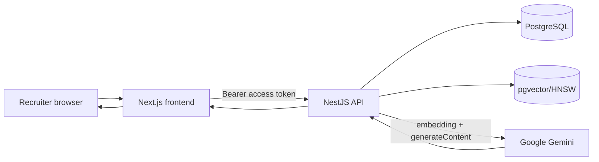
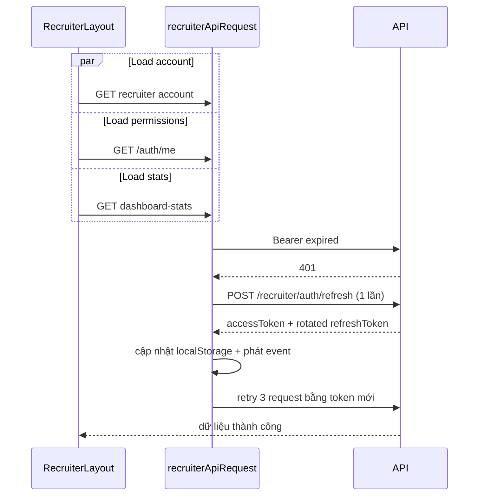
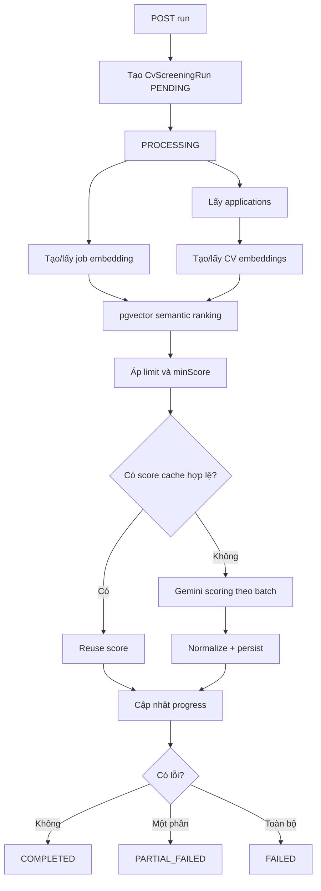

# Luồng kỹ thuật Recruiter end-to-end

> Cập nhật: 19/07/2026
> Phạm vi: xác thực recruiter, quản lý tin tuyển dụng, xem trước tin theo UI candidate, kiểm duyệt trạng thái, lọc/xếp hạng CV bằng AI và xem giải thích điểm.

## 1. Mục đích tài liệu

Tài liệu này mô tả cách dữ liệu đi từ giao diện recruiter đến backend, database, Gemini/pgvector rồi quay lại frontend. Mục tiêu là để một lập trình viên mới có thể:

- Hiểu đúng luồng nghiệp vụ và trạng thái.
- Biết file nào chịu trách nhiệm cho từng bước.
- Biết hợp đồng API và cấu trúc dữ liệu.
- Hiểu cách tính điểm, lý do bị trừ điểm và cách UI hiển thị.
- Hiểu cơ chế refresh access token và xử lý lỗi.
- Biết nơi cần sửa khi thay đổi rubric, API, preview hoặc trạng thái tin.
- Nhận diện các nhánh legacy còn tồn tại.

Tài liệu mô tả trạng thái code hiện tại của hai repository:

- Frontend: `upnext2` — Next.js/React.
- Backend: `upnextbe` — NestJS/Prisma/PostgreSQL/pgvector/Gemini.

## 2. Bản đồ file quan trọng

### 2.1. Backend

| Chức năng                          | File                                                                           |
| ---------------------------------- | ------------------------------------------------------------------------------ |
| Controller CV screening            | `src/modules/cv-screening/cv-screening.controller.ts`                          |
| Điều phối toàn bộ run lọc CV       | `src/modules/cv-screening/cv-screening.service.ts`                             |
| Tạo embedding và truy vấn pgvector | `src/modules/cv-screening/embedding.service.ts`                                |
| Gọi Gemini để chấm CV              | `src/modules/cv-screening/gemini-scoring.service.ts`                           |
| Rubric 100 điểm                    | `src/modules/cv-screening/scoring-rubric.ts`                                   |
| DTO chạy lọc                       | `src/modules/cv-screening/dto/run-cv-screening.dto.ts`                         |
| Model database                     | `prisma/schema.prisma`                                                         |
| Migration pgvector                 | `prisma/migrations/20260719090000_use_pgvector_for_cv_screening/migration.sql` |
| Controller tin tuyển dụng          | `src/modules/job-posts/job-posts.controller.ts`                                |
| Logic tin tuyển dụng               | `src/modules/job-posts/job-posts.service.ts`                                   |

### 2.2. Frontend

| Chức năng                        | File                                                                                    |
| -------------------------------- | --------------------------------------------------------------------------------------- |
| API CV screening                 | `src/features/recruiter/api/cv-screening-api.ts`                                        |
| State, polling và sessionStorage | `src/features/recruiter/hooks/use-cv-screening.ts`                                      |
| Bảng ứng viên/AI lọc CV          | `src/features/recruiter/components/recruiter-candidates-page.tsx`                       |
| Trang giải thích đánh giá        | `src/features/recruiter/components/candidate-evaluation-page.tsx`                       |
| Route trang đánh giá             | `src/app/[locale]/(workspace)/recruiter/candidates/[applicationId]/evaluation/page.tsx` |
| Request có refresh token         | `src/features/recruiter/api/client.ts`                                                  |
| Đọc/xóa recruiter session        | `src/features/recruiter/session.ts`                                                     |
| Recruiter workspace layout       | `src/app/[locale]/(workspace)/recruiter/layout.tsx`                                     |
| API tin tuyển dụng               | `src/features/recruiter/job-posts/api.ts`                                               |
| Form/list/filter tin tuyển dụng  | `src/features/recruiter/job-posts/job-posts-page.tsx`                                   |
| Preview tin tuyển dụng           | `src/features/recruiter/job-posts/recruiter-job-post-preview.tsx`                       |
| UI chi tiết tin phía candidate   | `src/features/public/jobs/components/job-detail-page.tsx`                               |
| CSS dùng chung với candidate     | `src/features/public/jobs/jobs-page.css`                                                |

### 2.3. Kiểm thử

| Phạm vi                                   | File                                                     |
| ----------------------------------------- | -------------------------------------------------------- |
| Refresh token, retry, chống refresh trùng | `src/features/recruiter/api/client.test.ts`              |
| State hook CV screening                   | `src/features/recruiter/hooks/use-cv-screening.test.tsx` |
| Bảng AI và trang đánh giá                 | `e2e/recruiter-ai-score-dialog.spec.ts`                  |
| Preview tin và filter trạng thái          | `e2e/recruiter-job-post-preview.spec.ts`                 |

## 3. Kiến trúc tổng thể



Backend xử lý quyền truy cập, tạo run bất đồng bộ, embedding, semantic retrieval, AI scoring và lưu kết quả. Frontend chỉ điều phối request, polling trạng thái, lưu state tạm và render kết quả.

## 4. Xác thực recruiter và refresh token

### 4.1. Dữ liệu phiên ở browser

Recruiter session được lưu trong `localStorage`:

| Key                             | Nội dung                        |
| ------------------------------- | ------------------------------- |
| `upnext.recruiter.accessToken`  | JWT dùng gọi API                |
| `upnext.recruiter.refreshToken` | Token dùng xin access token mới |
| `upnext.recruiter.tokenType`    | Thường là `Bearer`              |
| `upnext.recruiter.user`         | JSON tối thiểu có `id`          |

`getRecruiterSession()` trả về `{ accessToken, user }`. Nếu JSON lỗi hoặc không có `user.id`, hàm gọi `clearRecruiterSession()`.

### 4.2. Wrapper request

Mọi API recruiter mới nên gọi:

```ts
recruiterApiRequest<T>(path, token, init);
```

Luồng trong `src/features/recruiter/api/client.ts`:

1. Đọc access token mới nhất từ `localStorage`; token truyền vào chỉ là fallback.
2. Gọi `apiRequest()` với header `Authorization: Bearer ...`.
3. Nếu response không phải `401`, trả kết quả hoặc ném lỗi nguyên bản.
4. Nếu `401`, gọi `refreshRecruiterAccessToken()`.
5. Refresh thành công thì retry request ban đầu đúng một lần với token mới.
6. Refresh thất bại thì ném lại `401` ban đầu để page/layout xóa phiên và redirect.

### 4.3. Chống nhiều request refresh cùng lúc

Biến module-level:

```ts
let refreshRequest: Promise<string> | null = null;
```

Nếu account, `/auth/me` và dashboard stats đồng thời nhận `401`, request đầu tiên tạo promise refresh; các request còn lại dùng chung promise đó. Sau khi hoàn tất, `finally` đặt lại `refreshRequest = null`.



### 4.4. Event token mới

Sau refresh, frontend phát:

```ts
window.dispatchEvent(
  new CustomEvent("upnext:recruiter-session-refreshed", {
    detail: { accessToken },
  }),
);
```

`RecruiterCandidatesPage` lắng nghe event để cập nhật token trong React state. Điều này tránh hook polling tiếp tục giữ token cũ trong closure.

### 4.5. Hành vi khi refresh thất bại

- `401/403` dự kiến không được log bằng `console.error` trong recruiter layout.
- Layout gọi `clearRecruiterSession()`.
- Điều hướng đến `/recruiter/login`.
- Lỗi mạng hoặc lỗi `5xx` vẫn được log để phục vụ debug.

## 5. Luồng quản lý tin tuyển dụng

### 5.1. Trạng thái dữ liệu

Một tin có hai trục trạng thái khác nhau:

| Trường             | Giá trị chính                              | Ý nghĩa                          |
| ------------------ | ------------------------------------------ | -------------------------------- |
| `status`           | `DRAFT`, `PUBLISHED`, `CLOSED`, `ARCHIVED` | Vòng đời do recruiter điều khiển |
| `moderationStatus` | `PENDING`, `APPROVED`, `REJECTED`          | Kết quả kiểm duyệt nội dung      |

Không được gộp hai trường này thành một field trên API. Nhãn UI là phép ánh xạ từ cả hai.

### 5.2. Tạo bản nháp

Frontend dùng React Hook Form và Zod trong `job-posts-page.tsx`.

Các bước:

1. Recruiter nhập title, description, requirements, benefits, lương, số lượng, catalog IDs, địa điểm, kỹ năng, chuyên ngành và hạn nộp.
2. Zod kiểm tra dữ liệu; ví dụ title tối thiểu 5 ký tự, description tối thiểu 30 ký tự và `salaryMax >= salaryMin`.
3. Frontend gọi `POST /job-posts` bằng `createRecruiterJobPost()`.
4. Backend `JobPostsService.create()`:
   - Resolve recruiter và công ty.
   - Yêu cầu công ty đã có giấy phép kinh doanh.
   - Tạo slug.
   - Lưu tin với `status = DRAFT`.
5. Sau khi có `jobPost.id`, frontend chạy song song các API relation:
   - `POST /job-posts/:id/locations`
   - `POST /job-posts/:id/skills`
   - `POST /job-posts/:id/specializations`
6. Reload danh sách và quay về list.

Lưu ý: tạo job và tạo relation hiện không nằm trong một transaction duy nhất ở frontend. Nếu một relation thất bại sau khi job đã được tạo, bản nháp vẫn có thể tồn tại nhưng thiếu relation.

### 5.3. Chỉnh sửa

`startEdit(job)` đưa dữ liệu hiện tại vào form. Khi submit:

1. `PATCH /job-posts/:id` cập nhật field chính.
2. Frontend tính tập hợp chênh lệch cho location, skill và specialization.
3. Các relation cần thêm/xóa được gửi song song bằng `Promise.all()`.
4. Reload danh sách sau khi hoàn tất.

Ví dụ logic diff:

```ts
const toAdd = nextIds.filter((id) => !oldIds.includes(id));
const toRemove = oldIds.filter((id) => !nextIds.includes(id));
```

### 5.4. Tab xem trước

State:

```ts
const [editorTab, setEditorTab] = useState<"compose" | "preview">("compose");
const previewValues = form.watch();
```

- Tab `Soạn tin` giữ form mounted; chuyển tab không làm mất dữ liệu.
- Tab `Xem trước` truyền toàn bộ giá trị đang nhập vào `RecruiterJobPostPreview`.
- Preview dùng lại class `job-detail-*` và CSS của trang chi tiết candidate để đồng bộ UI.
- Các nút ứng tuyển, lưu tin và chia sẻ có `disabled`; chúng chỉ minh họa.
- Logo lấy từ `GET /companies/:companyId`, trường `logoFile.publicUrl`.
- Địa điểm dài được rút gọn thành thành phố; nhiều nơi hiển thị dạng `Hà Nội +2 địa điểm`.
- Heading rich text trùng như “Mô tả công việc”, “Yêu cầu ứng viên”, “Quyền lợi” được loại bỏ trước khi render để tránh tiêu đề lặp.

Preview không gọi API tạo tin và không thay đổi backend.

### 5.5. Đăng và đóng tin

Đăng tin:

```http
PATCH /job-posts/:id/publish
```

Backend:

1. Kiểm tra recruiter sở hữu tin.
2. Kiểm tra công ty có giấy phép kinh doanh.
3. Kiểm tra `verificationStatus === VERIFIED`.
4. Cập nhật `status = PUBLISHED` và `publishedAt = now()`.

Đóng tin:

```http
PATCH /job-posts/:id/close
```

Backend cập nhật `status = CLOSED`.

### 5.6. Filter trạng thái ở frontend

| Lựa chọn UI       | Điều kiện                                               |
| ----------------- | ------------------------------------------------------- |
| Tất cả trạng thái | Không lọc status                                        |
| Đang đăng         | `status === PUBLISHED && moderationStatus === APPROVED` |
| Chờ duyệt         | `status === PUBLISHED && moderationStatus === PENDING`  |
| Bản nháp          | `status === DRAFT`                                      |
| Đã đóng           | `status === CLOSED`                                     |

Nhánh `REJECTED` hiện chỉ thấy khi chọn “Tất cả trạng thái”; chưa có lựa chọn filter riêng.

## 6. Database cho CV screening

### 6.1. `cv_screening_runs`

Lưu một lần chạy:

- Job, company và recruiter khởi tạo.
- `totalApplications`, `processedCount`, `failedCount`.
- `limit`, `minScore`.
- `status`, `errorMessage`, thời gian bắt đầu/kết thúc.

Trạng thái run:

```text
PENDING -> PROCESSING -> COMPLETED
                      -> PARTIAL_FAILED
                      -> FAILED
```

### 6.2. `job_embeddings`

- Một row duy nhất cho mỗi `jobPostId`.
- `embeddingText`: văn bản job đã chuẩn hóa.
- `embeddingVector`: JSON giữ để tương thích ngược.
- `embedding_pgvector`: `vector(768)` dùng truy vấn thực tế.
- `modelName`: cache key gồm model, dimension và version chuẩn hóa.

### 6.3. `cv_embeddings`

- Một row cho mỗi `cvVersionId`.
- Liên kết candidate profile.
- Có JSON vector và pgvector tương tự job embedding.

### 6.4. `application_ai_scores`

- `applicationId` là unique: mỗi application chỉ có một AI score mới nhất.
- `runId` trỏ đến lần chạy hiện tại.
- Lưu semantic score, 4 score thành phần, `aiScore`, `finalScore`.
- Lưu matched/missing skills, strengths/weaknesses.
- `rawAiResponse` chứa `criteriaBreakdown` đầy đủ.
- `modelName` và `scoringVersion` dùng xác định cache còn hợp lệ.

### 6.5. Migration pgvector

Migration thực hiện:

1. `CREATE EXTENSION IF NOT EXISTS vector`.
2. Thêm `embedding_pgvector vector(768)` vào hai bảng.
3. Backfill từ JSON nếu đúng 768 phần tử.
4. Tạo partial HNSW index với `vector_cosine_ops`.

Nếu gặp:

```text
column "embedding_pgvector" does not exist
```

thì database đang chạy chưa áp dụng migration, hoặc ứng dụng đang trỏ nhầm database/schema. Cần kiểm tra migration history, `DATABASE_URL` và xác nhận cột tồn tại trong đúng database trước khi chạy screening.

## 7. API CV screening

Tất cả endpoint nằm dưới `/recruiter`, dùng `JwtAuthGuard`, `RolesGuard` và role `RECRUITER`.

### 7.1. Bắt đầu run

```http
POST /recruiter/cv-screening/run
Content-Type: application/json
Authorization: Bearer <token>

{
  "jobPostId": "uuid",
  "limit": 10,
  "minScore": 0
}
```

Validation:

- `jobPostId`: UUID.
- `limit`: 1–200.
- `minScore`: 0–100.

Response trả ngay:

```json
{
  "runId": "uuid",
  "status": "PENDING"
}
```

Backend không chờ toàn bộ quá trình. `setImmediate()` khởi động `processRun(run.id)` sau khi response được trả.

### 7.2. Poll trạng thái

```http
GET /recruiter/cv-screening/runs/:runId
```

Response quan trọng:

```json
{
  "id": "uuid",
  "totalApplications": 143,
  "processedCount": 10,
  "failedCount": 0,
  "status": "PROCESSING",
  "errorMessage": null
}
```

### 7.3. Lấy ranking

```http
GET /recruiter/cv-screening/runs/:runId/results
```

Backend đọc `application_ai_scores` theo `runId`, sắp xếp `finalScore DESC` và trả danh sách phục vụ bảng.

### 7.4. Chi tiết một application

```http
GET /recruiter/applications/:applicationId/ai-score
```

Response gồm:

- Candidate/job metadata.
- Tổng điểm và 4 điểm thành phần.
- Điểm semantic để audit.
- Strengths, weaknesses, matched/missing skills.
- Summary và recommendation.
- `criteriaBreakdown` từ raw AI response.
- `evaluationRubric` lấy từ constant backend.
- URL CV, model và scoring version.

### 7.5. Xem CV gốc

```http
GET /recruiter/applications/:applicationId/cv
```

Backend xác minh recruiter cùng công ty với job, lấy `cvVersionId`, stream file và đặt `Content-Disposition: inline`.

## 8. Pipeline CV screening ở backend



### 8.1. Kiểm tra quyền trước khi chạy

`startRun()`:

1. Resolve `RecruiterAccount` và `companyId`.
2. Kiểm tra job tồn tại.
3. So sánh `jobPost.companyId` với recruiter company.
4. Đếm application của job.
5. Tạo row run.

Recruiter công ty khác không thể chạy hoặc đọc run/application.

### 8.2. Tạo text embedding

Job text ghép từ title, description, requirements, benefits, category, type, level, skills, specialization và location.

CV text ghép từ parsed/file text và dữ liệu profile có cấu trúc như skills, experience, project, education, certification và preference.

Text được chuẩn hóa, giới hạn độ dài và gửi đến:

```text
models/gemini-embedding-001:embedContent
outputDimensionality = 768
```

Vector được L2 normalize trước khi lưu.

### 8.3. Cache embedding

Embedding được tái sử dụng khi đồng thời thỏa mãn:

- `modelName === EMBEDDING_CACHE_KEY`.
- `embeddingText` mới giống tuyệt đối text đã lưu.

Nếu job/CV thay đổi hoặc cache key thay đổi, embedding được tạo lại và cả JSON + pgvector được cập nhật.

### 8.4. Semantic retrieval bằng pgvector

Khoảng cách cosine:

```sql
"embedding_pgvector" <=> query_vector
```

Điểm semantic:

```text
semanticScore = (1 - cosineDistance) * 100
```

Query:

- Chỉ xét `cvVersionId` thuộc applications của job.
- Bỏ row có vector null.
- Áp `minScore` nếu có.
- Sort distance tăng dần.
- Limit theo yêu cầu, tối đa 200.
- Đặt `hnsw.ef_search = max(100, limit * 4)` trong transaction để tăng recall khi có filter ID.

### 8.5. Batch Gemini

Hằng số hiện tại:

| Hằng số                        | Giá trị |
| ------------------------------ | ------: |
| Embedding concurrency          |       8 |
| Gemini batch size              |       8 |
| Số batch Gemini chạy đồng thời |       1 |
| Fallback concurrency           |       1 |
| Default detailed limit         |     100 |
| Max detailed limit             |     200 |

Gemini scoring dùng `gemini-2.5-flash`, `temperature = 0`, `topP = 0.1`, JSON response schema bắt buộc.

Nếu batch lỗi và batch có nhiều CV, backend retry từng CV riêng. Nếu Gemini bỏ sót application trong output, backend cũng retry riêng application đó.

## 9. Rubric và công thức điểm

### 9.1. Tổng quan

```text
finalScore = aiScore
aiScore = skillScore + experienceScore + projectScore + educationScore
```

Không có cột “khớp kỹ năng” hoặc “điểm lọc hybrid” trong bảng UI hiện tại. Semantic score chỉ dùng để retrieval và làm yếu tố phụ trong prompt.

### 9.2. Kỹ năng — 40 điểm

| Hạng mục                   | Tối đa |
| -------------------------- | -----: |
| Kỹ năng bắt buộc           |     20 |
| Kỹ năng ưu tiên và công cụ |      8 |
| Độ thành thạo và seniority |      8 |
| Bối cảnh áp dụng kỹ năng   |      4 |

### 9.3. Kinh nghiệm — 30 điểm

| Hạng mục                     | Tối đa |
| ---------------------------- | -----: |
| Số năm kinh nghiệm liên quan |     12 |
| Độ tương đồng vai trò        |      8 |
| Domain và mức trách nhiệm    |      6 |
| Độ gần đây và liên tục       |      4 |

### 9.4. Dự án liên quan — 20 điểm

| Hạng mục                | Tối đa |
| ----------------------- | -----: |
| Mức liên quan của dự án |      8 |
| Độ sâu kỹ thuật         |      5 |
| Tác động và quy mô      |      4 |
| Chất lượng bằng chứng   |      3 |

### 9.5. Học vấn — 10 điểm

| Hạng mục                       | Tối đa |
| ------------------------------ | -----: |
| Bằng cấp và chuyên ngành       |      5 |
| Chứng chỉ và đào tạo           |      3 |
| Bằng chứng học thuật liên quan |      2 |

### 9.6. Giải thích và điểm bị trừ

Gemini phải trả cho từng hạng mục:

```ts
{
  key: string;
  awardedScore: number;
  reason: string;
  evidence: string;
}
```

Frontend không yêu cầu Gemini trả `deduction`. Nó tính:

```text
deduction = maxScore - awardedScore
```

Ví dụ:

```text
required-skills: tối đa 20, đạt 12
=> bị trừ 8 điểm
```

Backend normalize mọi item theo rubric:

- Thiếu item: tạo item với 0 điểm và thông báo thiếu bằng chứng.
- Điểm âm: clamp về 0.
- Điểm vượt max: clamp về max.
- Điểm group: tính lại bằng tổng item con, không tin score group Gemini trả trực tiếp.

Recommendation mặc định theo tổng điểm:

| Tổng điểm | Recommendation |
| --------- | -------------- |
| 85–100    | `strong_fit`   |
| 70–84     | `fit`          |
| 50–69     | `borderline`   |
| < 50      | `not_fit`      |

## 10. Lưu score và cache score

`persistScore()` làm tròn 2 chữ số, tính tổng 4 nhóm và `upsert` theo `applicationId`.

Score cũ được coi là có thể reuse khi:

- Cùng `modelName`.
- Cùng `SCORING_VERSION`.
- `score.updatedAt` mới hơn hoặc bằng cả job embedding và CV embedding.

Điều này tránh gọi Gemini lại khi job/CV/rubric/model chưa đổi.

### Cảnh báo quan trọng: nhánh legacy chưa đồng nhất

Code chấm mới trong `persistScore()` dùng:

```ts
const finalScore = aiScore;
```

Nhưng nhánh `reuseFreshScores()` hiện vẫn cập nhật:

```ts
finalScore = aiScore * 0.7 + semanticScore * 0.3;
```

Đây là công thức hybrid cũ và mâu thuẫn với yêu cầu “final score bằng tổng 4 tiêu chí”. Hệ quả: chạy lần đầu và chạy lại bằng cache có thể cho `finalScore` khác nhau dù CV/job không đổi.

Khuyến nghị sửa backend:

```ts
finalScore: this.roundScore(Number(score.aiScore));
```

Sau khi sửa nên tăng `SCORING_VERSION` hoặc cập nhật lại score để tránh dữ liệu cache cũ.

## 11. Frontend chạy và polling CV screening

### 11.1. State trong hook

`useCvScreening()` giữ:

- `selectedJobId`, `limit`.
- `runId`, `runStatus`, `progress`.
- `results`, `isRunning`, `error`, `hasFiltered`.

### 11.2. Bắt đầu lọc

1. Kiểm tra đã chọn job.
2. Xóa result/error cũ.
3. Gọi `POST /recruiter/cv-screening/run` với `minScore = 0`.
4. Lưu `runId` và status.
5. Tạo interval 2,5 giây gọi status endpoint.

### 11.3. Polling

- `PENDING`/`PROCESSING`: tiếp tục poll.
- `COMPLETED`/`PARTIAL_FAILED`: dừng interval và gọi results endpoint.
- `FAILED`: dừng interval và hiển thị `errorMessage`.
- Component unmount: clear interval.
- Reload trang khi run còn chạy: state từ sessionStorage giúp resume polling.

### 11.4. sessionStorage

| Key                         | Nội dung                   |
| --------------------------- | -------------------------- |
| `upnext_rankingTempJobId`   | Job đang chọn              |
| `upnext_rankingTempLimit`   | Limit                      |
| `upnext_rankingHasFiltered` | Đã từng chạy lọc           |
| `upnext_rankingRunId`       | Run hiện tại               |
| `upnext_rankingRunStatus`   | Status cuối cùng           |
| `upnext_rankingResults`     | JSON ranking hiện tại      |
| `upnext_activeTab`          | `cv-ranking` hoặc tab khác |

sessionStorage chỉ có phạm vi tab trình duyệt. Backend/database vẫn là nguồn sự thật cho run và score.

## 12. Bảng ranking và điều hướng chi tiết

Bảng AI hiện hiển thị các cột chính:

- Hạng.
- Ứng viên.
- Tin tuyển dụng.
- Độ phù hợp (`finalScore`).
- Thao tác.

Các cột legacy đã bỏ khỏi UI:

- Hạng sơ tuyển.
- Khớp kỹ năng.
- Điểm lọc hybrid.

Nút con mắt điều hướng đến:

```text
/{locale}/recruiter/candidates/{applicationId}/evaluation
```

Đây là page riêng, không phải dialog. Nút quay lại đặt:

```text
/recruiter/candidates?tab=cv-ranking
```

và lưu `upnext_activeTab = cv-ranking`, vì vậy recruiter quay lại đúng kết quả AI lọc CV.

## 13. Trang đánh giá ứng viên

`CandidateEvaluationPage`:

1. Đọc recruiter session.
2. Gọi `GET /recruiter/applications/:applicationId/ai-score`.
3. Render header candidate/job và tổng điểm.
4. Render 4 score card.
5. Khi chọn một card, tìm breakdown/rubric theo `key`.
6. Với từng item, hiển thị điểm đạt, điểm trừ, reason và evidence.
7. Icon thông tin mở toàn bộ rubric 100 điểm.
8. Sidebar cho phép xem CV, từ chối hoặc mời phỏng vấn.

Trường hợp đặc biệt:

- `401`: xóa session và redirect login.
- `404`: xóa application stale khỏi `upnext_rankingResults` và hiển thị thông báo chạy lọc lại.
- Score cũ không có breakdown: hiển thị cảnh báo cần chạy lọc lại.
- CV có public URL: mở trực tiếp.
- CV private: fetch endpoint có auth, tạo Blob URL rồi mở.

## 14. Hợp đồng dữ liệu breakdown

Ví dụ rút gọn:

```json
{
  "applicationId": "uuid",
  "finalScore": 31,
  "skillScore": 10,
  "experienceScore": 5,
  "projectScore": 8,
  "educationScore": 8,
  "criteriaBreakdown": [
    {
      "key": "skills",
      "summary": "Ứng viên mới đáp ứng một phần kỹ năng bắt buộc.",
      "items": [
        {
          "key": "required-skills",
          "awardedScore": 10,
          "reason": "Có JavaScript nhưng thiếu TypeScript và Next.js.",
          "evidence": "CV ghi nhận JavaScript và React."
        }
      ]
    }
  ],
  "evaluationRubric": [
    {
      "key": "skills",
      "label": "Kỹ năng",
      "maxScore": 40,
      "criteria": []
    }
  ]
}
```

Frontend ghép `criteriaBreakdown.items[*].key` với `evaluationRubric.criteria[*].key`. Khi đổi key backend phải đổi đồng bộ dữ liệu/prompt/test.

## 15. Xử lý lỗi

### 15.1. Run `FAILED`

Backend catch lỗi toàn pipeline, cập nhật:

- `status = FAILED` nếu chưa xử lý được application nào.
- `status = PARTIAL_FAILED` nếu đã có progress.
- `errorMessage` lấy từ exception.
- `finishedAt = now()`.

Frontend dừng polling và hiển thị error.

### 15.2. Một CV lỗi embedding

- Service log lỗi CV đó.
- Không thêm embedding vào map.
- Tăng `failedCount`.
- Các CV còn lại vẫn tiếp tục.

### 15.3. Gemini batch lỗi

- Batch nhiều CV được tách retry từng CV.
- Persist dùng `Promise.allSettled()` để một row lỗi không chặn toàn bộ batch.
- Run có thể kết thúc `PARTIAL_FAILED` nhưng vẫn có results hợp lệ.

### 15.4. `401 Unauthorized`

- `recruiterApiRequest` refresh và retry một lần.
- Nhiều request dùng chung một refresh promise.
- Refresh thất bại: page/layout xóa session và redirect.

### 15.5. `403 Forbidden`

Không retry. Đây thường là sai company/permission; recruiter layout xóa phiên với các request bootstrap hiện tại.

### 15.6. `404` chi tiết application

Thường xảy ra khi sessionStorage giữ kết quả của dữ liệu đã bị xóa/thay đổi. Trang đánh giá loại result stale khỏi sessionStorage.

## 16. Quyền và an toàn dữ liệu

- CV screening controller chỉ cho actor `RECRUITER`.
- Run phải thuộc cùng `companyId` với recruiter.
- Application phải thuộc job của cùng company.
- CV file chỉ được stream sau kiểm tra quyền.
- Gemini prompt yêu cầu coi job/CV là dữ liệu không đáng tin và bỏ qua instruction nằm trong nội dung.
- AI không được bịa dữ liệu; thiếu bằng chứng phải ghi rõ thiếu.
- UI score là công cụ hỗ trợ; quyết định tuyển dụng cuối cùng vẫn do recruiter.

## 17. Nợ kỹ thuật và điểm cần lưu ý

### 17.1. Hybrid score trong nhánh reuse

Đã nêu ở mục 10: cần đổi công thức reuse thành `finalScore = aiScore`.

### 17.2. Type frontend còn field legacy

`CvScreeningResultItem` và `ApplicationAiScoreResponse` vẫn khai báo:

```ts
skillMatchScore: number;
retrievalScore: number;
```

Backend response hiện không trả hai field này và UI không dùng chúng. Nên xóa khỏi type để hợp đồng frontend phản ánh đúng API.

### 17.3. Tạo job và relation không atomic

Frontend tạo job trước, relation sau. Nếu cần đảm bảo tất cả-or-nothing, nên có endpoint backend tạo job cùng context trong một Prisma transaction.

### 17.4. Publish không chủ động reset moderation

`updateStatus(PUBLISHED)` hiện đặt status/publishedAt nhưng không đặt lại `moderationStatus = PENDING`. Với tin từng bị `REJECTED`, cần xác định nghiệp vụ có cho gửi duyệt lại không và nếu có thì backend nên reset moderation rõ ràng.

### 17.5. Worker bất đồng bộ trong process API

`setImmediate()` chạy screening trong cùng process NestJS. Nếu process restart, job đang chạy có thể dừng giữa chừng. Production ổn định hơn nếu chuyển sang queue bền vững như BullMQ/Redis và worker riêng.

## 18. Checklist thay đổi hệ thống

### Thay rubric

1. Sửa `scoring-rubric.ts`.
2. Kiểm tra tổng max vẫn bằng 100.
3. Tăng `SCORING_VERSION`.
4. Cập nhật test Gemini/backend.
5. Cập nhật type/fixture E2E nếu đổi key.
6. Chạy lại screening để tạo breakdown mới.

### Đổi model embedding

1. Đổi model/dimension trong `embedding.service.ts`.
2. Đổi cache key.
3. Nếu dimension đổi, tạo migration pgvector mới.
4. Rebuild index đúng vector dimension.
5. Backfill embedding.

### Đổi UI trang đánh giá

1. Sửa `candidate-evaluation-page.tsx`.
2. Giữ phép tính deduction từ rubric.
3. Kiểm tra desktop/mobile.
4. Chạy `e2e/recruiter-ai-score-dialog.spec.ts`.

### Đổi preview tin

1. Ưu tiên thay đổi component/CSS candidate trước nếu muốn đồng bộ cả hai role.
2. Kiểm tra mapping form trong `RecruiterJobPostPreview`.
3. Giữ form mounted khi đổi tab.
4. Chạy `e2e/recruiter-job-post-preview.spec.ts`.

## 19. Lệnh kiểm tra đề xuất

Frontend:

```powershell
pnpm.cmd exec tsc --noEmit --pretty false
pnpm.cmd exec vitest run src/features/recruiter/api/client.test.ts
pnpm.cmd exec vitest run src/features/recruiter/hooks/use-cv-screening.test.tsx
pnpm.cmd exec playwright test e2e/recruiter-ai-score-dialog.spec.ts --project=chromium
pnpm.cmd exec playwright test e2e/recruiter-job-post-preview.spec.ts --project=chromium
```

Backend:

```powershell
npm.cmd run build
npm.cmd test -- cv-screening
```

Kiểm tra database pgvector:

```sql
SELECT extname FROM pg_extension WHERE extname = 'vector';

SELECT column_name, udt_name
FROM information_schema.columns
WHERE table_name IN ('job_embeddings', 'cv_embeddings')
  AND column_name = 'embedding_pgvector';
```

## 20. Tóm tắt luồng hoàn chỉnh

1. Recruiter đăng nhập; frontend lưu access/refresh token.
2. Layout tải account, permission, stats bằng request có auto-refresh.
3. Recruiter tạo bản nháp tin và relation; có thể xem trước bằng đúng UI candidate.
4. Recruiter publish; backend kiểm tra ownership, license và company verification.
5. Candidate nộp application kèm CV version.
6. Recruiter mở tab AI lọc CV, chọn job/limit và tạo run.
7. Backend trả `runId`, xử lý bất đồng bộ.
8. Backend tạo/reuse embedding job và CV.
9. pgvector lấy top CV theo semantic score.
10. Gemini chấm 4 nhóm theo rubric 100 điểm và trả reason/evidence.
11. Backend normalize, tính tổng, lưu score và progress.
12. Frontend poll đến khi hoàn tất rồi tải ranking.
13. Recruiter mở trang đánh giá riêng của application.
14. Frontend hiển thị điểm đạt, điểm bị trừ, lý do và bằng chứng.
15. Recruiter xem CV, từ chối hoặc mời phỏng vấn; quay lại đúng tab AI lọc CV.
